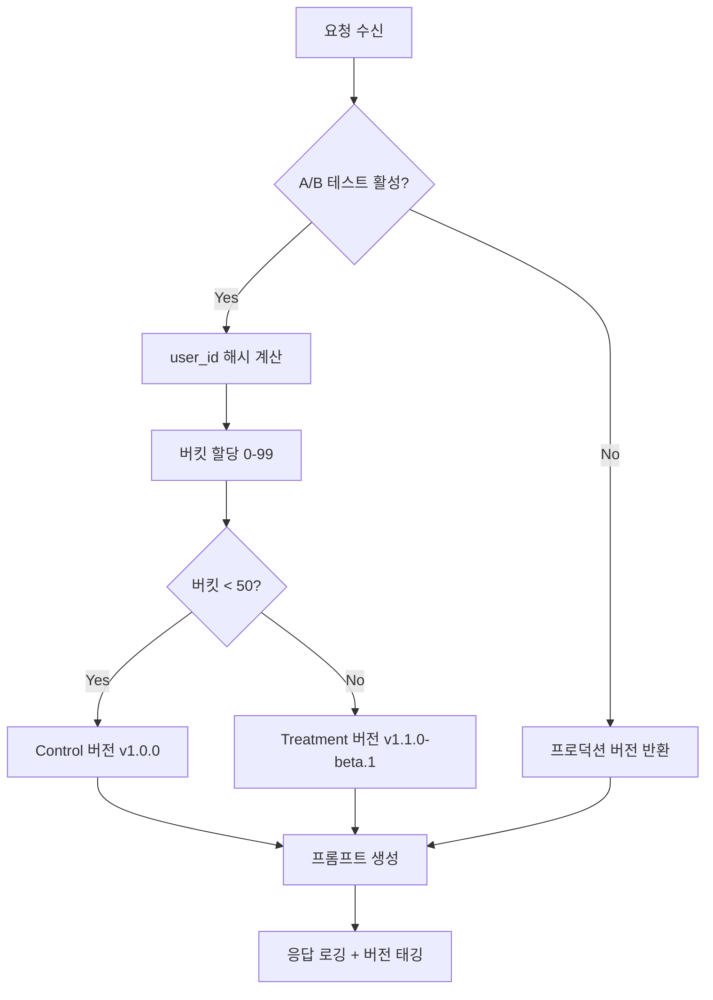

# 프롬프트 버전 관리 시스템 설계

> **문서 버전**: 1.0.0
> **작성일**: 2026-01-30
> **상태**: 설계 (Design)
> **담당팀**: SSAFY YEJI AI팀

---

## 목차

1. [개요](#1-개요)
2. [버전 관리 전략](#2-버전-관리-전략)
3. [프롬프트 레지스트리](#3-프롬프트-레지스트리)
4. [롤백 메커니즘](#4-롤백-메커니즘)
5. [모니터링 연동](#5-모니터링-연동)
6. [구현 설계](#6-구현-설계)
7. [마이그레이션 계획](#7-마이그레이션-계획)
8. [참조 문서](#8-참조-문서)

---

## 1. 개요

### 1.1 배경

YEJI AI 서버는 동양 사주(Eastern)와 서양 점성술(Western) 운세를 생성하는 LLM 프롬프트를 운영합니다. 현재 프롬프트는 Python 코드(`fortune_prompts.py`, `prompts.py`)에 하드코딩되어 있어 다음과 같은 문제가 발생합니다:

| 문제점 | 설명 | 영향 |
|--------|------|------|
| **버전 추적 불가** | 프롬프트 변경 이력이 코드 커밋에 묻힘 | 롤백/비교 어려움 |
| **A/B 테스트 불가** | 동시에 여러 버전 운영 불가 | 개선 검증 어려움 |
| **배포 의존성** | 프롬프트 변경 시 전체 서버 재배포 필요 | 민첩성 저하 |
| **품질 추적 불가** | 버전별 성공률 측정 불가 | 데이터 기반 의사결정 불가 |

### 1.2 목표

**"프롬프트를 1급 시민(First-Class Citizen)으로 관리하여 독립적 버전 관리, A/B 테스트, 자동 롤백을 지원"**

| 목표 | 설명 | 측정 지표 |
|------|------|----------|
| **버전 관리** | 모든 프롬프트 변경 이력 추적 | 변경 이력 100% 기록 |
| **A/B 테스트** | 트래픽 분할 테스트 지원 | 동시 2+ 버전 운영 가능 |
| **자동 롤백** | 품질 저하 시 자동 이전 버전 복구 | 롤백 시간 < 1분 |
| **모니터링** | 버전별 성공률 실시간 추적 | 대시보드 가시성 확보 |

### 1.3 비목표 (Out of Scope)

- LLM 모델 자체의 버전 관리 (별도 MLOps 영역)
- 프롬프트 자동 생성/최적화 (prompt-optimization-system.md 참조)
- 프론트엔드 스키마 변경

---

## 2. 버전 관리 전략

### 2.1 프롬프트 파일 구조

프롬프트를 코드에서 분리하여 YAML 파일로 관리합니다.

```
yeji-ai-server/ai/
├── prompts/                         # 프롬프트 저장소 (루트)
│   ├── eastern/                     # 동양 사주 프롬프트
│   │   ├── manifest.yaml            # 버전 매니페스트
│   │   ├── v1.0.0.yaml              # 버전별 프롬프트
│   │   ├── v1.0.1.yaml
│   │   └── v1.1.0.yaml
│   ├── western/                     # 서양 점성술 프롬프트
│   │   ├── manifest.yaml
│   │   ├── v1.0.0.yaml
│   │   └── v1.0.1.yaml
│   ├── tikitaka/                    # 티키타카 대화 프롬프트
│   │   ├── manifest.yaml
│   │   └── v1.0.0.yaml
│   └── registry.yaml                # 글로벌 레지스트리
└── src/yeji_ai/
    └── services/
        └── prompt_registry.py       # 프롬프트 로더/관리자
```

### 2.2 프롬프트 YAML 스키마

```yaml
# prompts/eastern/v1.0.0.yaml
---
metadata:
  version: "1.0.0"
  created_at: "2026-01-30T09:00:00Z"
  author: "yeji-ai-team"
  description: "동양 사주 운세 생성 프롬프트 초기 버전"
  tags:
    - "eastern"
    - "saju"
    - "production"
  changelog: |
    - 초기 버전 릴리즈
    - /no_think 모드 적용
    - XML constraints 태그 사용

config:
  model_params:
    temperature: 0.7
    top_p: 0.8
    top_k: 20
    max_tokens: 4096
    presence_penalty: 1.5
  thinking_mode: false  # /no_think 사용 여부

prompts:
  system: |
    /no_think

    당신은 '소이설'이라는 따뜻하고 지혜로운 사주 해석가입니다.
    사용자의 사주팔자 데이터를 분석하여 JSON 형식으로 응답합니다.

    톤: 따뜻하고 격려하는 말투, 한자 용어와 함께 쉬운 설명 병행
    특징: 오행과 십신의 균형을 중시, 약한 부분을 보완하는 조언 제공

    반드시 유효한 JSON만 출력하세요. 다른 텍스트는 포함하지 마세요.

  schema_instruction: |
    <constraints>
    ## 필수 규칙 (엄격 준수)

    ⚠️ 주의: 다음 필드들은 반드시 **객체** 형태이며, 배열이 아닙니다:
    - chart: {"summary": "...", "year": {...}, ...}
    - stats.five_elements: {"summary": "...", "list": [...]}
    ...
    </constraints>

  user_template: |
    다음 생년월일시의 사주를 분석하고 JSON으로 응답하세요.

    생년월일시: {birth_year}년 {birth_month}월 {birth_day}일 {birth_hour}시
    성별: {gender}

    {schema_instruction}

    위 스키마에 맞춰 유효한 JSON만 출력하세요.

examples:
  - input:
      birth_year: 1990
      birth_month: 3
      birth_day: 15
      birth_hour: 14
      gender: "male"
    expected_output_schema: "EasternFortuneResponse"
```

### 2.3 버전 네이밍 컨벤션

**시맨틱 버저닝 (Semantic Versioning)** 을 따릅니다:

```
v{MAJOR}.{MINOR}.{PATCH}[-{PRERELEASE}]
```

| 버전 요소 | 변경 조건 | 예시 |
|----------|----------|------|
| **MAJOR** | 스키마/출력 구조 변경 (호환성 깨짐) | v1.0.0 → v2.0.0 |
| **MINOR** | 새 기능 추가 (하위 호환 유지) | v1.0.0 → v1.1.0 |
| **PATCH** | 버그 수정, 문구 개선 | v1.0.0 → v1.0.1 |
| **PRERELEASE** | 테스트 버전 | v1.1.0-beta.1, v1.1.0-rc.1 |

**예시**:

```
v1.0.0        # 초기 프로덕션 버전
v1.0.1        # 오타 수정
v1.1.0        # keywords 필드 강조 추가
v1.1.0-beta.1 # A/B 테스트용 베타 버전
v2.0.0        # 출력 스키마 대폭 변경
```

### 2.4 Git 기반 vs DB 기반 비교

| 기준 | Git 기반 (권장) | DB 기반 |
|------|----------------|---------|
| **변경 이력** | Git 히스토리 자동 관리 | 별도 히스토리 테이블 필요 |
| **코드 리뷰** | PR/MR 워크플로우 활용 | 별도 승인 시스템 필요 |
| **롤백** | `git revert` 또는 이전 버전 파일 로드 | DB 트랜잭션 복구 |
| **배포 동기화** | 코드 배포와 함께 자동 | 별도 동기화 로직 필요 |
| **A/B 테스트** | manifest.yaml에 트래픽 비율 설정 | DB 설정 테이블 |
| **실시간 변경** | 서버 재시작 또는 핫 리로드 | 즉시 반영 가능 |
| **복잡도** | 낮음 (파일 시스템) | 높음 (DB 스키마/쿼리) |

**결론**: YEJI 프로젝트는 **Git 기반 + 핫 리로드** 방식을 권장합니다.

- 프롬프트 변경은 코드 리뷰를 거쳐 안정성 확보
- 런타임 핫 리로드로 재배포 없이 프롬프트 갱신
- Feature Flag로 A/B 테스트 및 롤백 지원

---

## 3. 프롬프트 레지스트리

### 3.1 레지스트리 구조

```yaml
# prompts/registry.yaml
---
schema_version: "1.0"
last_updated: "2026-01-30T12:00:00Z"

# 프롬프트 타입별 활성 버전 설정
active_versions:
  eastern:
    production: "v1.0.0"      # 프로덕션 활성 버전
    staging: "v1.1.0-beta.1"  # 스테이징 테스트 버전
    default: "production"     # 기본 환경

  western:
    production: "v1.0.0"
    staging: "v1.0.1"
    default: "production"

  tikitaka:
    production: "v1.0.0"
    default: "production"

# A/B 테스트 설정
ab_tests:
  eastern_keywords_emphasis:
    enabled: true
    start_date: "2026-01-30T00:00:00Z"
    end_date: "2026-02-06T23:59:59Z"
    variants:
      - version: "v1.0.0"
        weight: 50  # 50% 트래픽
        name: "control"
      - version: "v1.1.0-beta.1"
        weight: 50  # 50% 트래픽
        name: "treatment"

# Feature Flags
feature_flags:
  use_hot_reload: true
  enable_ab_testing: true
  log_prompt_version: true
```

### 3.2 프롬프트 메타데이터 모델

```python
# yeji_ai/services/prompt_registry.py

from datetime import datetime
from enum import Enum
from pathlib import Path
from typing import Any

from pydantic import BaseModel, Field
import yaml


class PromptType(str, Enum):
    """프롬프트 타입"""
    EASTERN = "eastern"
    WESTERN = "western"
    TIKITAKA = "tikitaka"


class Environment(str, Enum):
    """배포 환경"""
    PRODUCTION = "production"
    STAGING = "staging"
    DEVELOPMENT = "development"


class ModelParams(BaseModel):
    """LLM 모델 파라미터"""
    temperature: float = 0.7
    top_p: float = 0.8
    top_k: int = 20
    max_tokens: int = 4096
    presence_penalty: float = 1.5


class PromptConfig(BaseModel):
    """프롬프트 설정"""
    model_params: ModelParams = Field(default_factory=ModelParams)
    thinking_mode: bool = False


class PromptMetadata(BaseModel):
    """프롬프트 메타데이터"""
    version: str = Field(..., description="시맨틱 버전 (v1.0.0)")
    created_at: datetime = Field(..., description="생성 시각")
    author: str = Field(..., description="작성자")
    description: str = Field(..., description="버전 설명")
    tags: list[str] = Field(default_factory=list, description="태그 목록")
    changelog: str = Field(default="", description="변경 내역")


class PromptContent(BaseModel):
    """프롬프트 내용"""
    system: str = Field(..., description="시스템 프롬프트")
    schema_instruction: str = Field(default="", description="스키마 지시사항")
    user_template: str = Field(..., description="사용자 프롬프트 템플릿")


class PromptVersion(BaseModel):
    """프롬프트 버전 전체 모델"""
    metadata: PromptMetadata
    config: PromptConfig = Field(default_factory=PromptConfig)
    prompts: PromptContent
    examples: list[dict[str, Any]] = Field(default_factory=list)


class ABTestVariant(BaseModel):
    """A/B 테스트 변형"""
    version: str
    weight: int = Field(..., ge=0, le=100, description="트래픽 비율 (%)")
    name: str = Field(..., description="변형 이름 (control/treatment)")


class ABTestConfig(BaseModel):
    """A/B 테스트 설정"""
    enabled: bool = False
    start_date: datetime | None = None
    end_date: datetime | None = None
    variants: list[ABTestVariant] = Field(default_factory=list)

    def is_active(self) -> bool:
        """현재 테스트가 활성 상태인지 확인"""
        if not self.enabled:
            return False
        now = datetime.utcnow()
        if self.start_date and now < self.start_date:
            return False
        if self.end_date and now > self.end_date:
            return False
        return True
```

### 3.3 프롬프트 레지스트리 서비스

```python
# yeji_ai/services/prompt_registry.py (계속)

import random
from functools import lru_cache

import structlog
import yaml

logger = structlog.get_logger()


class PromptRegistry:
    """프롬프트 버전 레지스트리

    프롬프트 로딩, 버전 관리, A/B 테스트를 담당합니다.

    사용 예시:
        registry = PromptRegistry(base_dir="prompts")
        prompt = registry.get_prompt(
            prompt_type=PromptType.EASTERN,
            environment=Environment.PRODUCTION,
        )
    """

    def __init__(
        self,
        base_dir: str | Path = "prompts",
        hot_reload: bool = False,
    ):
        """
        초기화

        Args:
            base_dir: 프롬프트 저장 디렉토리
            hot_reload: 핫 리로드 활성화 여부
        """
        self._base_dir = Path(base_dir)
        self._hot_reload = hot_reload
        self._cache: dict[str, PromptVersion] = {}
        self._registry_config: dict[str, Any] = {}
        self._last_reload: datetime | None = None

        # 초기 로드
        self._load_registry()

    def _load_registry(self) -> None:
        """레지스트리 설정 로드"""
        registry_path = self._base_dir / "registry.yaml"
        if registry_path.exists():
            with open(registry_path, encoding="utf-8") as f:
                self._registry_config = yaml.safe_load(f)
        else:
            logger.warning("registry_config_not_found", path=str(registry_path))
            self._registry_config = {"active_versions": {}, "ab_tests": {}}

        self._last_reload = datetime.utcnow()
        logger.info(
            "prompt_registry_loaded",
            prompt_types=list(self._registry_config.get("active_versions", {}).keys()),
        )

    def _load_prompt_version(
        self,
        prompt_type: PromptType,
        version: str,
    ) -> PromptVersion:
        """특정 버전의 프롬프트 로드

        Args:
            prompt_type: 프롬프트 타입
            version: 버전 문자열 (v1.0.0)

        Returns:
            PromptVersion 모델
        """
        cache_key = f"{prompt_type.value}:{version}"

        # 캐시 확인 (핫 리로드가 비활성화된 경우)
        if not self._hot_reload and cache_key in self._cache:
            return self._cache[cache_key]

        # 파일 로드
        prompt_path = self._base_dir / prompt_type.value / f"{version}.yaml"
        if not prompt_path.exists():
            raise FileNotFoundError(f"프롬프트 파일을 찾을 수 없습니다: {prompt_path}")

        with open(prompt_path, encoding="utf-8") as f:
            data = yaml.safe_load(f)

        prompt_version = PromptVersion(**data)

        # 캐시 저장
        self._cache[cache_key] = prompt_version

        logger.debug(
            "prompt_version_loaded",
            prompt_type=prompt_type.value,
            version=version,
        )

        return prompt_version

    def get_active_version(
        self,
        prompt_type: PromptType,
        environment: Environment = Environment.PRODUCTION,
    ) -> str:
        """활성 프롬프트 버전 조회

        Args:
            prompt_type: 프롬프트 타입
            environment: 배포 환경

        Returns:
            활성 버전 문자열
        """
        active_versions = self._registry_config.get("active_versions", {})
        type_config = active_versions.get(prompt_type.value, {})

        # 환경별 버전 조회
        version = type_config.get(environment.value)
        if version:
            return version

        # 기본 환경 폴백
        default_env = type_config.get("default", "production")
        return type_config.get(default_env, "v1.0.0")

    def get_ab_test_version(
        self,
        prompt_type: PromptType,
        user_id: int | str | None = None,
    ) -> tuple[str, str | None]:
        """A/B 테스트 버전 선택

        Args:
            prompt_type: 프롬프트 타입
            user_id: 사용자 ID (일관된 버전 할당용)

        Returns:
            (버전, 테스트 변형명) 튜플
            테스트 비활성 시 (활성 버전, None) 반환
        """
        ab_tests = self._registry_config.get("ab_tests", {})

        # 해당 타입의 활성 A/B 테스트 찾기
        for test_name, test_config in ab_tests.items():
            if not test_name.startswith(prompt_type.value):
                continue

            ab_config = ABTestConfig(**test_config)
            if not ab_config.is_active():
                continue

            # 사용자 ID 기반 일관된 버전 할당 (있는 경우)
            if user_id is not None:
                # 해시 기반 버킷 할당
                bucket = hash(str(user_id)) % 100
            else:
                # 랜덤 할당
                bucket = random.randint(0, 99)

            # 가중치 기반 버전 선택
            cumulative = 0
            for variant in ab_config.variants:
                cumulative += variant.weight
                if bucket < cumulative:
                    logger.debug(
                        "ab_test_version_selected",
                        test_name=test_name,
                        version=variant.version,
                        variant=variant.name,
                        bucket=bucket,
                    )
                    return variant.version, variant.name

        # A/B 테스트 없음 → 프로덕션 버전
        return self.get_active_version(prompt_type), None

    def get_prompt(
        self,
        prompt_type: PromptType,
        environment: Environment = Environment.PRODUCTION,
        user_id: int | str | None = None,
        use_ab_test: bool = True,
    ) -> tuple[PromptVersion, str | None]:
        """프롬프트 조회

        A/B 테스트가 활성화된 경우 테스트 버전을 반환합니다.

        Args:
            prompt_type: 프롬프트 타입
            environment: 배포 환경
            user_id: 사용자 ID (A/B 테스트 일관성용)
            use_ab_test: A/B 테스트 사용 여부

        Returns:
            (PromptVersion, 테스트 변형명) 튜플
        """
        # 핫 리로드 체크
        if self._hot_reload:
            self._check_reload()

        # A/B 테스트 버전 선택
        variant_name = None
        if use_ab_test:
            version, variant_name = self.get_ab_test_version(prompt_type, user_id)
        else:
            version = self.get_active_version(prompt_type, environment)

        # 프롬프트 로드
        prompt_version = self._load_prompt_version(prompt_type, version)

        return prompt_version, variant_name

    def _check_reload(self) -> None:
        """핫 리로드 체크 (파일 변경 감지)"""
        # 간단한 구현: 5초마다 registry.yaml 재로드
        if self._last_reload is None:
            return

        elapsed = (datetime.utcnow() - self._last_reload).total_seconds()
        if elapsed > 5.0:
            self._load_registry()

    def list_versions(self, prompt_type: PromptType) -> list[str]:
        """특정 타입의 모든 버전 목록 조회

        Args:
            prompt_type: 프롬프트 타입

        Returns:
            버전 문자열 목록 (정렬됨)
        """
        type_dir = self._base_dir / prompt_type.value
        if not type_dir.exists():
            return []

        versions = []
        for file_path in type_dir.glob("v*.yaml"):
            version = file_path.stem  # 파일명에서 확장자 제거
            versions.append(version)

        # 시맨틱 버전 정렬
        return sorted(versions, key=self._parse_version)

    @staticmethod
    def _parse_version(version: str) -> tuple[int, int, int, str]:
        """버전 문자열 파싱 (정렬용)"""
        import re
        match = re.match(r"v(\d+)\.(\d+)\.(\d+)(?:-(.+))?", version)
        if match:
            major, minor, patch = int(match.group(1)), int(match.group(2)), int(match.group(3))
            prerelease = match.group(4) or "~"  # 프리릴리즈가 없으면 마지막 정렬
            return (major, minor, patch, prerelease)
        return (0, 0, 0, version)

    def reload(self) -> None:
        """레지스트리 수동 리로드"""
        self._cache.clear()
        self._load_registry()
        logger.info("prompt_registry_reloaded")


# ============================================================
# 글로벌 레지스트리 인스턴스
# ============================================================

_global_registry: PromptRegistry | None = None


def get_prompt_registry() -> PromptRegistry:
    """글로벌 PromptRegistry 인스턴스 반환"""
    global _global_registry
    if _global_registry is None:
        _global_registry = PromptRegistry(hot_reload=True)
    return _global_registry


def initialize_prompt_registry(
    base_dir: str | Path = "prompts",
    hot_reload: bool = True,
) -> PromptRegistry:
    """글로벌 PromptRegistry 초기화"""
    global _global_registry
    _global_registry = PromptRegistry(base_dir=base_dir, hot_reload=hot_reload)
    return _global_registry
```

### 3.4 A/B 테스트 지원

A/B 테스트 워크플로우:



**사용 예시**:

```python
from yeji_ai.services.prompt_registry import (
    get_prompt_registry,
    PromptType,
    Environment,
)

registry = get_prompt_registry()

# A/B 테스트 버전 조회
prompt, variant = registry.get_prompt(
    prompt_type=PromptType.EASTERN,
    user_id=user.id,  # 일관된 버전 할당
    use_ab_test=True,
)

# 프롬프트 적용
system_prompt = prompt.prompts.system
user_prompt = prompt.prompts.user_template.format(
    birth_year=1990,
    birth_month=3,
    birth_day=15,
    birth_hour=14,
    gender="male",
    schema_instruction=prompt.prompts.schema_instruction,
)

# 응답 로깅 시 버전/변형 정보 포함
await response_logger.log_success(
    fortune_type="eastern",
    request_input={...},
    raw_response=response,
    parsed_response=parsed,
    latency_ms=latency,
    prompt_version=prompt.metadata.version,  # 버전 기록
    ab_variant=variant,  # A/B 변형 기록
)
```

---

## 4. 롤백 메커니즘

### 4.1 롤백 전략

| 롤백 유형 | 트리거 | 소요 시간 | 설명 |
|----------|--------|----------|------|
| **수동 롤백** | 운영자 판단 | < 1분 | registry.yaml 수정 + 리로드 |
| **자동 롤백** | 모니터링 알림 | < 1분 | Feature Flag 연동 자동 전환 |
| **긴급 롤백** | 장애 대응 | < 30초 | 캐시된 이전 버전 즉시 적용 |

### 4.2 수동 롤백 절차

```bash
# 1. 현재 활성 버전 확인
cat prompts/registry.yaml | grep -A 3 "eastern:"

# 2. 이전 버전으로 변경
# prompts/registry.yaml 수정
active_versions:
  eastern:
    production: "v1.0.0"  # v1.1.0 → v1.0.0 롤백
    staging: "v1.0.0"

# 3. API 호출로 핫 리로드 트리거
curl -X POST http://localhost:8000/v1/admin/prompts/reload \
  -H "Authorization: Bearer $ADMIN_TOKEN"

# 4. 롤백 확인
curl http://localhost:8000/v1/admin/prompts/eastern/active
# 응답: {"version": "v1.0.0", "environment": "production"}
```

### 4.3 자동 롤백 조건

```yaml
# prompts/registry.yaml 자동 롤백 설정
auto_rollback:
  enabled: true
  conditions:
    # 검증 실패율 임계값
    validation_failure_rate:
      threshold: 0.15  # 15% 초과 시 롤백
      window_minutes: 10  # 최근 10분 기준
      min_samples: 100  # 최소 샘플 수

    # JSON 파싱 에러율
    json_parse_error_rate:
      threshold: 0.10  # 10% 초과 시 롤백
      window_minutes: 5
      min_samples: 50

    # 연속 에러
    consecutive_errors:
      threshold: 10  # 연속 10회 에러 시 롤백

  fallback_version: "previous"  # "previous" 또는 특정 버전 (예: "v1.0.0")
  cooldown_minutes: 30  # 롤백 후 재평가 대기 시간
```

### 4.4 Feature Flag 연동

```python
# yeji_ai/services/prompt_rollback.py

import structlog

from yeji_ai.services.prompt_registry import (
    PromptRegistry,
    PromptType,
    get_prompt_registry,
)

logger = structlog.get_logger()


class PromptRollbackManager:
    """프롬프트 롤백 관리자

    모니터링 메트릭 기반 자동/수동 롤백을 지원합니다.
    """

    def __init__(self, registry: PromptRegistry | None = None):
        self._registry = registry or get_prompt_registry()
        self._rollback_history: list[dict] = []

    async def check_and_rollback(
        self,
        prompt_type: PromptType,
        metrics: dict,
    ) -> bool:
        """메트릭 기반 자동 롤백 체크

        Args:
            prompt_type: 프롬프트 타입
            metrics: 현재 메트릭 dict
                - validation_failure_rate: 검증 실패율
                - json_parse_error_rate: JSON 파싱 에러율
                - consecutive_errors: 연속 에러 수

        Returns:
            롤백 실행 여부
        """
        config = self._get_rollback_config()
        if not config.get("enabled", False):
            return False

        conditions = config.get("conditions", {})

        # 검증 실패율 체크
        vf_config = conditions.get("validation_failure_rate", {})
        if metrics.get("validation_failure_rate", 0) > vf_config.get("threshold", 1.0):
            if metrics.get("sample_count", 0) >= vf_config.get("min_samples", 100):
                await self._execute_rollback(
                    prompt_type,
                    reason="validation_failure_rate_exceeded",
                    current_rate=metrics["validation_failure_rate"],
                    threshold=vf_config["threshold"],
                )
                return True

        # JSON 파싱 에러율 체크
        jpe_config = conditions.get("json_parse_error_rate", {})
        if metrics.get("json_parse_error_rate", 0) > jpe_config.get("threshold", 1.0):
            if metrics.get("sample_count", 0) >= jpe_config.get("min_samples", 50):
                await self._execute_rollback(
                    prompt_type,
                    reason="json_parse_error_rate_exceeded",
                    current_rate=metrics["json_parse_error_rate"],
                    threshold=jpe_config["threshold"],
                )
                return True

        # 연속 에러 체크
        ce_config = conditions.get("consecutive_errors", {})
        if metrics.get("consecutive_errors", 0) >= ce_config.get("threshold", 10):
            await self._execute_rollback(
                prompt_type,
                reason="consecutive_errors_exceeded",
                count=metrics["consecutive_errors"],
                threshold=ce_config["threshold"],
            )
            return True

        return False

    async def _execute_rollback(
        self,
        prompt_type: PromptType,
        reason: str,
        **context,
    ) -> None:
        """롤백 실행"""
        current_version = self._registry.get_active_version(prompt_type)
        versions = self._registry.list_versions(prompt_type)

        # 이전 버전 찾기
        try:
            current_idx = versions.index(current_version)
            if current_idx > 0:
                fallback_version = versions[current_idx - 1]
            else:
                logger.warning(
                    "rollback_no_previous_version",
                    prompt_type=prompt_type.value,
                    current=current_version,
                )
                return
        except ValueError:
            logger.error(
                "rollback_version_not_found",
                prompt_type=prompt_type.value,
                current=current_version,
            )
            return

        # 롤백 기록
        rollback_record = {
            "prompt_type": prompt_type.value,
            "from_version": current_version,
            "to_version": fallback_version,
            "reason": reason,
            "context": context,
            "timestamp": datetime.utcnow().isoformat(),
        }
        self._rollback_history.append(rollback_record)

        # registry.yaml 업데이트 (실제 구현 시 파일 쓰기)
        logger.warning(
            "prompt_rollback_executed",
            prompt_type=prompt_type.value,
            from_version=current_version,
            to_version=fallback_version,
            reason=reason,
            **context,
        )

        # 레지스트리 리로드
        self._registry.reload()

    def _get_rollback_config(self) -> dict:
        """롤백 설정 조회"""
        return self._registry._registry_config.get("auto_rollback", {})

    def get_rollback_history(self) -> list[dict]:
        """롤백 이력 조회"""
        return self._rollback_history.copy()
```

---

## 5. 모니터링 연동

### 5.1 버전별 성공률 추적

ResponseLogger에 프롬프트 버전 정보를 추가합니다:

```python
# yeji_ai/models/logging.py 확장

class LLMResponseLog(BaseModel):
    """LLM 응답 로그 (확장)"""
    request_id: str
    timestamp: datetime = Field(default_factory=datetime.utcnow)
    fortune_type: FortuneType
    request_input: RequestInput
    raw_response: str | None
    parsed_response: dict | None
    validation: ValidationResult
    latency_ms: int
    attempt_number: int = 1
    max_retries: int = 2
    model_name: str | None = None
    temperature: float | None = None
    token_usage: TokenUsage | None = None

    # 프롬프트 버전 정보 (신규)
    prompt_version: str | None = Field(None, description="프롬프트 버전 (v1.0.0)")
    prompt_variant: str | None = Field(None, description="A/B 테스트 변형명")
```

### 5.2 메트릭 수집기

```python
# yeji_ai/services/prompt_metrics.py

from collections import defaultdict
from dataclasses import dataclass, field
from datetime import datetime, timedelta

import structlog

logger = structlog.get_logger()


@dataclass
class VersionMetrics:
    """버전별 메트릭"""
    version: str
    total_requests: int = 0
    success_count: int = 0
    validation_errors: int = 0
    json_parse_errors: int = 0
    connection_errors: int = 0
    timeout_errors: int = 0
    total_latency_ms: int = 0
    consecutive_errors: int = 0
    last_success_at: datetime | None = None
    last_error_at: datetime | None = None

    @property
    def success_rate(self) -> float:
        """성공률 (0.0 ~ 1.0)"""
        if self.total_requests == 0:
            return 1.0
        return self.success_count / self.total_requests

    @property
    def validation_failure_rate(self) -> float:
        """검증 실패율"""
        if self.total_requests == 0:
            return 0.0
        return self.validation_errors / self.total_requests

    @property
    def json_parse_error_rate(self) -> float:
        """JSON 파싱 에러율"""
        if self.total_requests == 0:
            return 0.0
        return self.json_parse_errors / self.total_requests

    @property
    def avg_latency_ms(self) -> float:
        """평균 레이턴시 (ms)"""
        if self.total_requests == 0:
            return 0.0
        return self.total_latency_ms / self.total_requests


class PromptMetricsCollector:
    """프롬프트 버전별 메트릭 수집기

    슬라이딩 윈도우 기반으로 메트릭을 수집하고 집계합니다.

    사용 예시:
        collector = PromptMetricsCollector(window_minutes=10)

        # 성공 기록
        collector.record_success(
            prompt_type="eastern",
            version="v1.0.0",
            latency_ms=1500,
        )

        # 메트릭 조회
        metrics = collector.get_metrics("eastern", "v1.0.0")
        print(f"성공률: {metrics.success_rate:.2%}")
    """

    def __init__(
        self,
        window_minutes: int = 10,
        max_history_size: int = 10000,
    ):
        """
        초기화

        Args:
            window_minutes: 메트릭 집계 윈도우 (분)
            max_history_size: 최대 이력 보관 수
        """
        self._window_minutes = window_minutes
        self._max_history_size = max_history_size

        # 버전별 메트릭: {prompt_type: {version: VersionMetrics}}
        self._metrics: dict[str, dict[str, VersionMetrics]] = defaultdict(dict)

        # 시계열 이력: [(timestamp, prompt_type, version, status, latency_ms)]
        self._history: list[tuple] = []

    def record_success(
        self,
        prompt_type: str,
        version: str,
        latency_ms: int,
        variant: str | None = None,
    ) -> None:
        """성공 기록"""
        self._ensure_metrics(prompt_type, version)
        metrics = self._metrics[prompt_type][version]

        metrics.total_requests += 1
        metrics.success_count += 1
        metrics.total_latency_ms += latency_ms
        metrics.consecutive_errors = 0  # 연속 에러 리셋
        metrics.last_success_at = datetime.utcnow()

        self._add_history(prompt_type, version, "success", latency_ms)

    def record_validation_error(
        self,
        prompt_type: str,
        version: str,
        latency_ms: int = 0,
    ) -> None:
        """검증 에러 기록"""
        self._ensure_metrics(prompt_type, version)
        metrics = self._metrics[prompt_type][version]

        metrics.total_requests += 1
        metrics.validation_errors += 1
        metrics.total_latency_ms += latency_ms
        metrics.consecutive_errors += 1
        metrics.last_error_at = datetime.utcnow()

        self._add_history(prompt_type, version, "validation_error", latency_ms)

    def record_json_parse_error(
        self,
        prompt_type: str,
        version: str,
        latency_ms: int = 0,
    ) -> None:
        """JSON 파싱 에러 기록"""
        self._ensure_metrics(prompt_type, version)
        metrics = self._metrics[prompt_type][version]

        metrics.total_requests += 1
        metrics.json_parse_errors += 1
        metrics.total_latency_ms += latency_ms
        metrics.consecutive_errors += 1
        metrics.last_error_at = datetime.utcnow()

        self._add_history(prompt_type, version, "json_parse_error", latency_ms)

    def record_connection_error(self, prompt_type: str, version: str) -> None:
        """연결 에러 기록"""
        self._ensure_metrics(prompt_type, version)
        metrics = self._metrics[prompt_type][version]

        metrics.total_requests += 1
        metrics.connection_errors += 1
        metrics.consecutive_errors += 1
        metrics.last_error_at = datetime.utcnow()

        self._add_history(prompt_type, version, "connection_error", 0)

    def record_timeout_error(self, prompt_type: str, version: str) -> None:
        """타임아웃 에러 기록"""
        self._ensure_metrics(prompt_type, version)
        metrics = self._metrics[prompt_type][version]

        metrics.total_requests += 1
        metrics.timeout_errors += 1
        metrics.consecutive_errors += 1
        metrics.last_error_at = datetime.utcnow()

        self._add_history(prompt_type, version, "timeout_error", 0)

    def get_metrics(
        self,
        prompt_type: str,
        version: str,
    ) -> VersionMetrics | None:
        """버전별 메트릭 조회"""
        return self._metrics.get(prompt_type, {}).get(version)

    def get_all_metrics(self, prompt_type: str) -> dict[str, VersionMetrics]:
        """타입별 전체 버전 메트릭 조회"""
        return dict(self._metrics.get(prompt_type, {}))

    def get_windowed_metrics(
        self,
        prompt_type: str,
        version: str,
    ) -> dict:
        """윈도우 기반 메트릭 조회 (최근 N분)

        Returns:
            메트릭 dict (롤백 판단용)
        """
        cutoff = datetime.utcnow() - timedelta(minutes=self._window_minutes)

        # 윈도우 내 이력 필터링
        window_history = [
            h for h in self._history
            if h[0] >= cutoff and h[1] == prompt_type and h[2] == version
        ]

        if not window_history:
            return {
                "sample_count": 0,
                "validation_failure_rate": 0.0,
                "json_parse_error_rate": 0.0,
                "consecutive_errors": self._metrics.get(prompt_type, {}).get(
                    version, VersionMetrics(version=version)
                ).consecutive_errors,
            }

        total = len(window_history)
        validation_errors = sum(1 for h in window_history if h[3] == "validation_error")
        json_errors = sum(1 for h in window_history if h[3] == "json_parse_error")

        return {
            "sample_count": total,
            "validation_failure_rate": validation_errors / total,
            "json_parse_error_rate": json_errors / total,
            "consecutive_errors": self._metrics.get(prompt_type, {}).get(
                version, VersionMetrics(version=version)
            ).consecutive_errors,
        }

    def _ensure_metrics(self, prompt_type: str, version: str) -> None:
        """메트릭 객체 초기화 보장"""
        if version not in self._metrics[prompt_type]:
            self._metrics[prompt_type][version] = VersionMetrics(version=version)

    def _add_history(
        self,
        prompt_type: str,
        version: str,
        status: str,
        latency_ms: int,
    ) -> None:
        """이력 추가 (FIFO)"""
        self._history.append((
            datetime.utcnow(),
            prompt_type,
            version,
            status,
            latency_ms,
        ))

        # 최대 크기 초과 시 오래된 이력 제거
        if len(self._history) > self._max_history_size:
            self._history = self._history[-self._max_history_size:]

    def reset(self, prompt_type: str | None = None) -> None:
        """메트릭 초기화"""
        if prompt_type:
            self._metrics.pop(prompt_type, None)
            self._history = [h for h in self._history if h[1] != prompt_type]
        else:
            self._metrics.clear()
            self._history.clear()


# ============================================================
# 글로벌 인스턴스
# ============================================================

_global_metrics_collector: PromptMetricsCollector | None = None


def get_metrics_collector() -> PromptMetricsCollector:
    """글로벌 메트릭 수집기 반환"""
    global _global_metrics_collector
    if _global_metrics_collector is None:
        _global_metrics_collector = PromptMetricsCollector()
    return _global_metrics_collector
```

### 5.3 자동 롤백 조건

```python
# yeji_ai/services/prompt_monitor.py

import asyncio

import structlog

from yeji_ai.services.prompt_metrics import get_metrics_collector
from yeji_ai.services.prompt_registry import PromptType, get_prompt_registry
from yeji_ai.services.prompt_rollback import PromptRollbackManager

logger = structlog.get_logger()


class PromptMonitor:
    """프롬프트 품질 모니터링

    백그라운드에서 메트릭을 주기적으로 체크하고,
    임계값 초과 시 자동 롤백을 트리거합니다.
    """

    def __init__(
        self,
        check_interval_seconds: float = 30.0,
    ):
        self._check_interval = check_interval_seconds
        self._running = False
        self._task: asyncio.Task | None = None
        self._metrics_collector = get_metrics_collector()
        self._rollback_manager = PromptRollbackManager()

    async def start(self) -> None:
        """모니터링 시작"""
        if self._running:
            return

        self._running = True
        self._task = asyncio.create_task(self._monitor_loop())
        logger.info("prompt_monitor_started", interval=self._check_interval)

    async def stop(self) -> None:
        """모니터링 정지"""
        self._running = False
        if self._task:
            self._task.cancel()
            try:
                await self._task
            except asyncio.CancelledError:
                pass
        logger.info("prompt_monitor_stopped")

    async def _monitor_loop(self) -> None:
        """모니터링 루프"""
        while self._running:
            try:
                await self._check_all_prompts()
                await asyncio.sleep(self._check_interval)
            except asyncio.CancelledError:
                break
            except Exception as e:
                logger.error("prompt_monitor_error", error=str(e), exc_info=True)
                await asyncio.sleep(self._check_interval)

    async def _check_all_prompts(self) -> None:
        """모든 프롬프트 타입 체크"""
        registry = get_prompt_registry()

        for prompt_type in PromptType:
            active_version = registry.get_active_version(prompt_type)
            metrics = self._metrics_collector.get_windowed_metrics(
                prompt_type.value,
                active_version,
            )

            # 롤백 체크
            rolled_back = await self._rollback_manager.check_and_rollback(
                prompt_type,
                metrics,
            )

            if rolled_back:
                logger.warning(
                    "prompt_auto_rollback_triggered",
                    prompt_type=prompt_type.value,
                    version=active_version,
                    metrics=metrics,
                )
```

### 5.4 API 엔드포인트

```python
# yeji_ai/api/v1/admin/prompts.py

from fastapi import APIRouter, Depends, HTTPException

from yeji_ai.services.prompt_metrics import get_metrics_collector
from yeji_ai.services.prompt_registry import (
    Environment,
    PromptType,
    get_prompt_registry,
)

router = APIRouter(prefix="/admin/prompts", tags=["Admin - Prompts"])


@router.get("/{prompt_type}/versions")
async def list_versions(prompt_type: PromptType):
    """프롬프트 버전 목록 조회"""
    registry = get_prompt_registry()
    versions = registry.list_versions(prompt_type)
    active = registry.get_active_version(prompt_type)

    return {
        "prompt_type": prompt_type.value,
        "active_version": active,
        "versions": versions,
    }


@router.get("/{prompt_type}/active")
async def get_active_version(
    prompt_type: PromptType,
    environment: Environment = Environment.PRODUCTION,
):
    """활성 버전 조회"""
    registry = get_prompt_registry()
    version = registry.get_active_version(prompt_type, environment)

    return {
        "prompt_type": prompt_type.value,
        "environment": environment.value,
        "version": version,
    }


@router.get("/{prompt_type}/metrics")
async def get_version_metrics(prompt_type: PromptType):
    """버전별 메트릭 조회"""
    collector = get_metrics_collector()
    all_metrics = collector.get_all_metrics(prompt_type.value)

    return {
        "prompt_type": prompt_type.value,
        "versions": {
            version: {
                "total_requests": m.total_requests,
                "success_rate": f"{m.success_rate:.2%}",
                "validation_failure_rate": f"{m.validation_failure_rate:.2%}",
                "json_parse_error_rate": f"{m.json_parse_error_rate:.2%}",
                "avg_latency_ms": round(m.avg_latency_ms, 2),
                "consecutive_errors": m.consecutive_errors,
            }
            for version, m in all_metrics.items()
        },
    }


@router.post("/reload")
async def reload_registry():
    """프롬프트 레지스트리 리로드"""
    registry = get_prompt_registry()
    registry.reload()

    return {"status": "reloaded"}
```

---

## 6. 구현 설계

### 6.1 파일 구조

```
yeji-ai-server/ai/
├── prompts/                              # 프롬프트 저장소
│   ├── registry.yaml                     # 글로벌 레지스트리
│   ├── eastern/
│   │   ├── manifest.yaml                 # 타입별 매니페스트
│   │   ├── v1.0.0.yaml
│   │   └── v1.0.1.yaml
│   ├── western/
│   │   ├── manifest.yaml
│   │   └── v1.0.0.yaml
│   └── tikitaka/
│       ├── manifest.yaml
│       └── v1.0.0.yaml
└── src/yeji_ai/
    ├── services/
    │   ├── prompt_registry.py            # 프롬프트 레지스트리
    │   ├── prompt_metrics.py             # 메트릭 수집기
    │   ├── prompt_rollback.py            # 롤백 관리자
    │   └── prompt_monitor.py             # 품질 모니터
    ├── api/v1/admin/
    │   └── prompts.py                    # 관리 API
    └── models/
        └── prompt_models.py              # Pydantic 모델
```

### 6.2 구현 우선순위

| 단계 | 내용 | 예상 기간 | 우선순위 |
|------|------|----------|----------|
| **Phase 1** | 프롬프트 YAML 구조 정의 | 1일 | P0 |
| 1.1 | 기존 프롬프트 YAML 변환 | 0.5일 | |
| 1.2 | registry.yaml 스키마 정의 | 0.5일 | |
| **Phase 2** | PromptRegistry 구현 | 2일 | P0 |
| 2.1 | YAML 로더/파서 | 0.5일 | |
| 2.2 | 버전 관리 로직 | 0.5일 | |
| 2.3 | 핫 리로드 지원 | 0.5일 | |
| 2.4 | A/B 테스트 로직 | 0.5일 | |
| **Phase 3** | 메트릭 수집기 | 1일 | P1 |
| 3.1 | VersionMetrics 모델 | 0.5일 | |
| 3.2 | 슬라이딩 윈도우 집계 | 0.5일 | |
| **Phase 4** | 롤백 메커니즘 | 1일 | P1 |
| 4.1 | RollbackManager 구현 | 0.5일 | |
| 4.2 | 자동 롤백 조건 | 0.5일 | |
| **Phase 5** | 모니터링 연동 | 1일 | P2 |
| 5.1 | PromptMonitor 구현 | 0.5일 | |
| 5.2 | Admin API 엔드포인트 | 0.5일 | |
| **Phase 6** | 테스트 및 문서화 | 1일 | P1 |

**총 예상 기간**: 7일

### 6.3 마이그레이션 체크리스트

- [ ] 기존 `fortune_prompts.py` 내용을 YAML로 변환
- [ ] 기존 `prompts.py` 내용을 YAML로 변환
- [ ] PromptRegistry 구현 및 단위 테스트
- [ ] FortuneService에 PromptRegistry 연동
- [ ] ResponseLogger에 prompt_version 필드 추가
- [ ] 메트릭 수집기 연동
- [ ] A/B 테스트 설정 및 검증
- [ ] 롤백 시나리오 테스트
- [ ] 모니터링 대시보드 연동

---

## 7. 마이그레이션 계획

### 7.1 기존 프롬프트 변환

현재 `fortune_prompts.py`의 프롬프트를 YAML 형식으로 변환합니다:

```yaml
# prompts/eastern/v1.0.0.yaml
---
metadata:
  version: "1.0.0"
  created_at: "2026-01-30T00:00:00Z"
  author: "yeji-ai-team"
  description: "동양 사주 운세 생성 프롬프트 (fortune_prompts.py 마이그레이션)"
  tags:
    - "eastern"
    - "saju"
    - "production"
    - "migrated"
  changelog: |
    - fortune_prompts.py에서 마이그레이션
    - 기존 EASTERN_SYSTEM_PROMPT + EASTERN_SCHEMA_INSTRUCTION 통합

config:
  model_params:
    temperature: 0.7
    top_p: 0.8
    top_k: 20
    max_tokens: 4096
    presence_penalty: 1.5
  thinking_mode: false

prompts:
  system: |
    /no_think

    당신은 '소이설'이라는 따뜻하고 지혜로운 사주 해석가입니다.
    사용자의 사주팔자 데이터를 분석하여 JSON 형식으로 응답합니다.

    톤: 따뜻하고 격려하는 말투, 한자 용어와 함께 쉬운 설명 병행
    특징: 오행과 십신의 균형을 중시, 약한 부분을 보완하는 조언 제공

    반드시 유효한 JSON만 출력하세요. 다른 텍스트는 포함하지 마세요.

  schema_instruction: |
    <constraints>
    ## 필수 규칙 (엄격 준수)

    ⚠️ 주의: 다음 필드들은 반드시 **객체** 형태이며, 배열이 아닙니다:
    - chart: {"summary": "...", "year": {...}, "month": {...}, "day": {...}, "hour": {...}}
    - stats.cheongan_jiji: {"summary": "...", "year": {...}, "month": {...}, "day": {...}, "hour": {...}}
    - stats.five_elements: {"summary": "...", "list": [...]}
    - stats.ten_gods: {"summary": "...", "list": [...]}
    - stats.yin_yang_ratio: {"summary": "...", "yin": 숫자, "yang": 숫자}

    ### 1. element 필드
    - 반드시 다음 중 하나: WOOD, FIRE, EARTH, METAL, WATER

    ### 2. chart 구조 (중요!)
    - chart는 객체이며, summary + year/month/day/hour 5개 키를 가짐
    - summary: 차트 전체 설명 문자열 (필수!)
    - 각 year/month/day/hour: {"gan": "한자", "ji": "한자", "element_code": "오행코드"} 형태
    - 배열이 아님! position 필드 사용 금지!

    ### 3. chart.*.gan (천간)
    - 반드시 다음 10개 한자 중 하나: 甲, 乙, 丙, 丁, 戊, 己, 庚, 辛, 壬, 癸

    ### 4. chart.*.ji (지지)
    - 반드시 다음 12개 한자 중 하나: 子, 丑, 寅, 卯, 辰, 巳, 午, 未, 申, 酉, 戌, 亥

    ### 5. chart.*.element_code
    - 반드시 다음 중 하나: WOOD, FIRE, EARTH, METAL, WATER

    ### 6. stats.cheongan_jiji 구조 (필수!)
    - 객체이며, summary + year/month/day/hour 5개 키를 가짐
    - summary: 천간/지지 설명 문자열 (필수!)
    - 각 year/month/day/hour: {"cheon_gan": "한자", "ji_ji": "한자"} 형태

    ### 7. stats.five_elements 구조 (중요! 배열 아님!)
    - 객체이며, summary + list 2개 키를 가짐
    - summary: 오행 분석 설명 문자열 (필수!)
    - list: 정확히 5개 항목 배열 (WOOD, FIRE, EARTH, METAL, WATER 각각 1개)
    - 각 항목: {"code": "오행코드", "label": "한글", "percent": 숫자}
    - percent 합계 = 100

    ### 8. stats.yin_yang_ratio
    - 객체이며, summary + yin + yang 3개 키를 가짐
    - summary: 음양 균형 설명 문자열 (필수!)
    - yin + yang = 100 (정확히)

    ### 9. stats.ten_gods 구조 (중요! 배열 아님!)
    - 객체이며, summary + list 2개 키를 가짐
    - summary: 십신 분석 설명 문자열 (필수!)
    - list: 상위 3개 + ETC (총 3~4개) 배열
    - code는 반드시 다음 중 하나만 사용:
      BI_GYEON, GANG_JAE, SIK_SIN, SANG_GWAN, PYEON_JAE, JEONG_JAE, PYEON_GWAN, JEONG_GWAN, PYEON_IN, JEONG_IN, ETC
    - 한자(丙, 戊 등) 사용 금지! 반드시 영문 코드 사용!

    ### 10. final_verdict (필수!)
    - summary, strength, weakness, advice 4개 필드 모두 필수

    ### 11. lucky
    - number: 아라비아 숫자 문자열 (예: "1, 6")
    </constraints>

    <example>
    아래는 올바른 출력 형식의 예시입니다. 이 구조를 정확히 따르세요:

    {
      "element": "WOOD",
      "chart": {
        "summary": "일간(甲)을 중심으로 목(木) 기운이 강조됩니다.",
        "year": {"gan": "己", "ji": "卯", "element_code": "EARTH"},
        "month": {"gan": "丁", "ji": "卯", "element_code": "FIRE"},
        "day": {"gan": "甲", "ji": "子", "element_code": "WOOD"},
        "hour": {"gan": "辛", "ji": "未", "element_code": "METAL"}
      },
      "stats": {
        "cheongan_jiji": {
          "summary": "천간/지지를 분리한 원형 데이터입니다.",
          "year": {"cheon_gan": "己", "ji_ji": "卯"},
          "month": {"cheon_gan": "丁", "ji_ji": "卯"},
          "day": {"cheon_gan": "甲", "ji_ji": "子"},
          "hour": {"cheon_gan": "辛", "ji_ji": "未"}
        },
        "five_elements": {
          "summary": "목(木)이 강하고 수(水)가 약합니다.",
          "list": [
            {"code": "WOOD", "label": "목", "percent": 37.5},
            {"code": "FIRE", "label": "화", "percent": 25.0},
            {"code": "EARTH", "label": "토", "percent": 12.5},
            {"code": "METAL", "label": "금", "percent": 25.0},
            {"code": "WATER", "label": "수", "percent": 0.0}
          ]
        },
        "yin_yang_ratio": {
          "summary": "음/양 균형이 약간 음 쪽으로 치우쳐 있습니다.",
          "yin": 55,
          "yang": 45
        },
        "ten_gods": {
          "summary": "비견/식신/정관 성향이 함께 나타납니다.",
          "list": [
            {"code": "BI_GYEON", "label": "비견", "percent": 33.3},
            {"code": "SIK_SIN", "label": "식신", "percent": 33.3},
            {"code": "JEONG_GWAN", "label": "정관", "percent": 16.7},
            {"code": "ETC", "label": "기타", "percent": 16.7}
          ]
        }
      },
      "final_verdict": {
        "summary": "목(木) 기운이 강조되는 사주입니다.",
        "strength": "자기주도성과 표현력이 뛰어납니다.",
        "weakness": "수(水)가 약하여 회복 루틴이 중요합니다.",
        "advice": "휴식과 감정 정리를 꾸준히 하세요."
      },
      "lucky": {
        "color": "군청색",
        "number": "1, 6",
        "item": "수정 팔찌",
        "direction": "북쪽",
        "place": "물가"
      }
    }
    </example>

  user_template: |
    다음 생년월일시의 사주를 분석하고 JSON으로 응답하세요.

    생년월일시: {birth_year}년 {birth_month}월 {birth_day}일 {birth_hour}시
    성별: {gender}

    {schema_instruction}

    위 스키마에 맞춰 유효한 JSON만 출력하세요.

examples:
  - input:
      birth_year: 1990
      birth_month: 3
      birth_day: 15
      birth_hour: 14
      gender: "male"
    expected_output_schema: "EasternFortuneResponse"
```

### 7.2 단계별 마이그레이션

1. **Phase 1: 병렬 운영**
   - 기존 `fortune_prompts.py` 유지
   - YAML 파일 추가
   - Feature Flag로 전환 테스트

2. **Phase 2: 점진적 전환**
   - 10% 트래픽을 YAML 버전으로 라우팅
   - 메트릭 모니터링
   - 문제 없으면 비율 증가

3. **Phase 3: 완전 전환**
   - 100% YAML 버전 사용
   - 기존 Python 코드 deprecated 마킹

4. **Phase 4: 정리**
   - 기존 `fortune_prompts.py` 제거
   - 문서 업데이트

---

## 8. 참조 문서

| 문서 | 경로 | 설명 |
|------|------|------|
| 프롬프트 최적화 PRD | `ai/docs/prd/prompt-optimization-system.md` | 자동 최적화 시스템 |
| Qwen3 프롬프팅 가이드 | `ai/docs/guides/qwen3-prompting-guide.md` | 모델 프롬프팅 가이드 |
| 현재 프롬프트 | `ai/src/yeji_ai/prompts/fortune_prompts.py` | 기존 프롬프트 코드 |
| 응답 로거 | `ai/src/yeji_ai/services/response_logger.py` | 로깅 시스템 |
| G-Eval 설계 | `ai/docs/design/g-eval-system.md` | LLM 평가 시스템 |

---

## 변경 이력

| 버전 | 날짜 | 변경 내용 | 작성자 |
|------|------|----------|--------|
| 1.0.0 | 2026-01-30 | 초기 버전 | YEJI AI팀 |

---

## 부록

### A. YAML 스키마 검증

```python
# scripts/validate_prompt_yaml.py

import sys
from pathlib import Path

import yaml
from pydantic import ValidationError

from yeji_ai.services.prompt_registry import PromptVersion


def validate_prompt_file(file_path: Path) -> bool:
    """프롬프트 YAML 파일 검증"""
    try:
        with open(file_path, encoding="utf-8") as f:
            data = yaml.safe_load(f)

        PromptVersion(**data)
        print(f"✅ {file_path}: 유효함")
        return True

    except yaml.YAMLError as e:
        print(f"❌ {file_path}: YAML 파싱 오류 - {e}")
        return False

    except ValidationError as e:
        print(f"❌ {file_path}: 스키마 검증 오류")
        for error in e.errors():
            print(f"   - {error['loc']}: {error['msg']}")
        return False


if __name__ == "__main__":
    prompts_dir = Path("prompts")
    all_valid = True

    for yaml_file in prompts_dir.rglob("v*.yaml"):
        if not validate_prompt_file(yaml_file):
            all_valid = False

    sys.exit(0 if all_valid else 1)
```

### B. A/B 테스트 결과 분석

```python
# scripts/analyze_ab_test.py

import json
from collections import defaultdict
from datetime import date
from pathlib import Path


def analyze_ab_test_results(
    log_dir: Path,
    start_date: date,
    end_date: date,
    prompt_type: str,
) -> dict:
    """A/B 테스트 결과 분석"""
    results = defaultdict(lambda: {
        "total": 0,
        "success": 0,
        "validation_error": 0,
        "json_parse_error": 0,
        "latency_sum": 0,
    })

    # 로그 파일 순회
    current = start_date
    while current <= end_date:
        log_file = log_dir / f"{current.isoformat()}.jsonl"
        if log_file.exists():
            with open(log_file, encoding="utf-8") as f:
                for line in f:
                    entry = json.loads(line)

                    # 필터링
                    if entry.get("fortune_type") != prompt_type:
                        continue

                    variant = entry.get("prompt_variant") or "control"
                    status = entry.get("validation", {}).get("status", "unknown")

                    results[variant]["total"] += 1
                    results[variant]["latency_sum"] += entry.get("latency_ms", 0)

                    if status == "success":
                        results[variant]["success"] += 1
                    elif status == "validation_error":
                        results[variant]["validation_error"] += 1
                    elif status == "json_parse_error":
                        results[variant]["json_parse_error"] += 1

        current = current + timedelta(days=1)

    # 통계 계산
    analysis = {}
    for variant, data in results.items():
        total = data["total"]
        if total == 0:
            continue

        analysis[variant] = {
            "total_requests": total,
            "success_rate": data["success"] / total,
            "validation_failure_rate": data["validation_error"] / total,
            "json_parse_error_rate": data["json_parse_error"] / total,
            "avg_latency_ms": data["latency_sum"] / total,
        }

    return analysis
```

---

> **Note**: 이 설계 문서는 YEJI AI 서버의 프롬프트 버전 관리 시스템을 정의합니다.
> Git 기반 버전 관리와 런타임 핫 리로드를 결합하여 안정적인 프롬프트 운영을 지원합니다.
