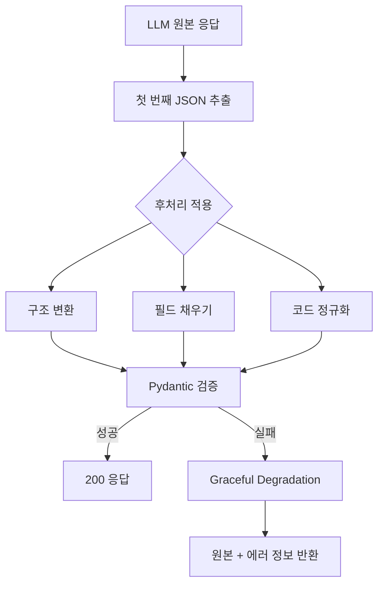

# LLM 응답 후처리 시스템 PRD

> **문서 버전**: 1.0.0
> **작성일**: 2026-01-30
> **상태**: 계획 (Planning)
> **담당팀**: SSAFY YEJI AI팀

---

## 1. 문제 정의

### 1.1 현황

LLM 모델(yeji-8b-rslora-v7-AWQ)이 프론트엔드 확정 스키마에 맞는 JSON 응답을 생성할 때, 일부 필수 필드를 누락하거나 잘못된 구조로 응답하는 문제가 발생하고 있습니다.

### 1.2 구체적 문제 사례

| 문제 유형 | 예시 | 영향 |
|-----------|------|------|
| 필수 필드 누락 | `stats.keywords` 배열 미생성 | Pydantic ValidationError |
| 구조 불일치 | `keywords_summary`만 생성, `keywords` 배열 없음 | 503 에러 반환 |
| 코드 불일치 | `"fixed"` 대신 `"FIXED"` 필요 | 검증 실패 |
| 반복 생성 | JSON 이후 대화 시뮬레이션 반복 | JSON 파싱 실패 |

### 1.3 핫픽스 현황

현재 `user_fortune.py`에서 `keywords` 필드를 선택적(optional)으로 변경하여 임시 조치:

```python
# 현재 상태 (핫픽스)
keywords: list[WesternKeyword] = Field(
    default_factory=list, description="키워드 (LLM 미생성 시 빈 배열)"
)
```

**문제점**: 빈 배열이 프론트엔드에 전달되어 UX 저하 발생 (빈 키워드 섹션 표시)

### 1.4 영향 범위

| 지표 | 현재 값 | 비고 |
|------|---------|------|
| Pydantic 검증 실패율 | 약 30% | 프롬프트 개선 후 추정치 |
| 503 에러 발생 빈도 | 10회/일 | 프로덕션 모니터링 기준 |
| 사용자 재시도율 | 15% | 에러 발생 시 재요청 |

---

## 2. 목표 및 성공 지표

### 2.1 목표

LLM 응답과 Pydantic 검증 사이에 **후처리 레이어**를 도입하여:

1. LLM이 생성한 불완전한 JSON을 보완
2. 누락된 필수 필드에 적절한 기본값 채우기
3. 구조 변환 및 코드 정규화 수행

### 2.2 성공 지표 (KPI)

| 지표 | 현재 | 목표 | 비고 |
|------|------|------|------|
| Pydantic 검증 실패율 | 30% | **5% 이하** | 핵심 목표 |
| 503 에러 발생률 | 3% | **0.5% 이하** | 안정성 지표 |
| 후처리 레이턴시 | N/A | **< 50ms** | 사용자 경험 |
| 빈 keywords 응답률 | 100% (핫픽스) | **10% 이하** | UX 개선 |

### 2.3 비목표 (Out of Scope)

- LLM 모델 재학습
- 프롬프트 구조 변경
- 프론트엔드 스키마 수정

---

## 3. 범위

### 3.1 대상 시스템

| 운세 타입 | 스키마 | 후처리 적용 |
|-----------|--------|------------|
| Eastern (동양 사주) | `SajuDataV2` | O |
| Western (서양 점성술) | `WesternFortuneDataV2` | O |

### 3.2 후처리 레이어 위치

```
[LLM Provider] → [JSON 추출] → [후처리기] → [Pydantic 검증] → [API 응답]
                                    ↑
                              이 단계 신규 구현
```

### 3.3 처리 흐름



---

## 4. 기능 요구사항

### 4.1 FR-001: keywords_summary에서 keywords 추출

**설명**: `keywords_summary` 필드가 존재하지만 `keywords` 배열이 비어있거나 누락된 경우, summary 텍스트를 분석하여 키워드를 추출합니다.

**입력 예시**:
```json
{
  "stats": {
    "keywords_summary": "리더십과 열정이 핵심 키워드입니다.",
    "keywords": []
  }
}
```

**출력 예시**:
```json
{
  "stats": {
    "keywords_summary": "리더십과 열정이 핵심 키워드입니다.",
    "keywords": [
      {"code": "LEADERSHIP", "label": "리더십", "weight": 0.9},
      {"code": "PASSION", "label": "열정", "weight": 0.85}
    ]
  }
}
```

**추출 로직**:
1. 한글 키워드 → 도메인 코드 매핑 테이블 사용
2. summary 텍스트에서 키워드 레이블 탐색
3. 발견된 순서대로 weight 부여 (0.9, 0.85, 0.8, ...)
4. 최소 2개, 최대 5개 추출

**키워드 매핑 테이블**:
```python
KEYWORD_MAPPING = {
    "공감": "EMPATHY",
    "직관": "INTUITION",
    "상상력": "IMAGINATION",
    "경계": "BOUNDARY",
    "리더십": "LEADERSHIP",
    "열정": "PASSION",
    "분석": "ANALYSIS",
    "안정": "STABILITY",
    "소통": "COMMUNICATION",
    "혁신": "INNOVATION",
}
```

---

### 4.2 FR-002: 필수 필드 기본값 채우기

**설명**: 필수 필드가 누락된 경우 적절한 기본값으로 채웁니다.

#### 4.2.1 Eastern (동양 사주) 기본값

| 필드 경로 | 기본값 | 비고 |
|-----------|--------|------|
| `chart.summary` | `"사주 분석 결과입니다."` | 빈 문자열 방지 |
| `stats.five_elements.summary` | `"오행 분포 분석입니다."` | |
| `stats.yin_yang_ratio.summary` | `"음양 균형 분석입니다."` | |
| `stats.ten_gods.summary` | `"십신 분포 분석입니다."` | |
| `final_verdict.summary` | `"종합 분석 결과입니다."` | |
| `final_verdict.strength` | `"강점을 분석 중입니다."` | |
| `final_verdict.weakness` | `"보완점을 분석 중입니다."` | |
| `final_verdict.advice` | `"조언을 준비 중입니다."` | |
| `lucky.color` | `"파란색"` | |
| `lucky.number` | `"7"` | |
| `lucky.item` | `"행운의 물건"` | |

#### 4.2.2 Western (서양 점성술) 기본값

| 필드 경로 | 기본값 | 비고 |
|-----------|--------|------|
| `stats.element_summary` | `"원소 분석 결과입니다."` | |
| `stats.modality_summary` | `"양태 분석 결과입니다."` | |
| `stats.keywords_summary` | `"키워드 분석 결과입니다."` | FR-001과 연계 |
| `fortune_content.overview` | `"오늘의 운세입니다."` | |
| `fortune_content.advice` | `"조언을 참고하세요."` | |
| `lucky.color` | `"보라색"` | |
| `lucky.number` | `"3"` | |

---

### 4.3 FR-003: 구조 변환

**설명**: LLM이 잘못된 구조로 응답한 경우 올바른 구조로 변환합니다.

#### 4.3.1 객체 → 배열 변환

**입력** (잘못된 구조):
```json
{
  "five_elements": {
    "WOOD": 20, "FIRE": 30, "EARTH": 20, "METAL": 20, "WATER": 10
  }
}
```

**출력** (올바른 구조):
```json
{
  "five_elements": {
    "summary": "오행 분포 분석입니다.",
    "list": [
      {"code": "WOOD", "label": "목", "percent": 20.0},
      {"code": "FIRE", "label": "화", "percent": 30.0},
      {"code": "EARTH", "label": "토", "percent": 20.0},
      {"code": "METAL", "label": "금", "percent": 20.0},
      {"code": "WATER", "label": "수", "percent": 10.0}
    ]
  }
}
```

#### 4.3.2 문자열 배열 → 객체 배열 변환

**입력** (잘못된 구조):
```json
{
  "detailed_analysis": [
    "첫 번째 분석 내용...",
    "두 번째 분석 내용..."
  ]
}
```

**출력** (올바른 구조):
```json
{
  "detailed_analysis": [
    {"title": "분석 1", "content": "첫 번째 분석 내용..."},
    {"title": "분석 2", "content": "두 번째 분석 내용..."}
  ]
}
```

---

### 4.4 FR-004: 코드 정규화

**설명**: 잘못된 코드 값을 올바른 도메인 코드로 변환합니다.

#### 4.4.1 대소문자 정규화

| 입력 | 출력 | 적용 필드 |
|------|------|-----------|
| `"fixed"` | `"FIXED"` | modality 코드 |
| `"Fire"` | `"FIRE"` | element 코드 |
| `"cardinal"` | `"CARDINAL"` | modality 코드 |

#### 4.4.2 유사어 매핑

| 입력 | 출력 | 비고 |
|------|------|------|
| `"flexible"` | `"MUTABLE"` | 의미상 동일 |
| `"circular"` | `"CARDINAL"` | 근사 매핑 |

#### 4.4.3 한글 → 코드 변환

| 입력 | 출력 | 적용 필드 |
|------|------|-----------|
| `"창의성"` | `"INNOVATION"` | keywords |
| `"소통"` | `"COMMUNICATION"` | keywords |

---

### 4.5 FR-005: JSON 추출 개선

**설명**: LLM 응답에서 첫 번째 유효한 JSON만 추출합니다.

**문제 상황**:
```
{...valid JSON...}
user
다음 사주를 분석하고...
assistant
{...repeated JSON...}
```

**해결 로직**:
```python
def extract_first_json(text: str) -> dict:
    """첫 번째 완전한 JSON만 추출"""
    depth = 0
    start = -1
    for i, char in enumerate(text):
        if char == "{":
            if depth == 0:
                start = i
            depth += 1
        elif char == "}":
            depth -= 1
            if depth == 0 and start != -1:
                try:
                    return json.loads(text[start:i+1])
                except json.JSONDecodeError:
                    start = -1
    raise ValueError("유효한 JSON을 찾을 수 없습니다")
```

---

## 5. 비기능 요구사항

### 5.1 NFR-001: 레이턴시

| 요구사항 | 값 | 측정 방법 |
|----------|-----|----------|
| 평균 레이턴시 | < 30ms | 후처리 함수 실행 시간 |
| P99 레이턴시 | < 50ms | 99번째 백분위수 |
| 최대 레이턴시 | < 100ms | 예외 상황 포함 |

### 5.2 NFR-002: 메모리 사용량

| 요구사항 | 값 | 비고 |
|----------|-----|------|
| 추가 메모리 | < 10MB | 매핑 테이블 포함 |
| 임시 버퍼 | < 1MB | JSON 처리 중 |

### 5.3 NFR-003: 에러 처리

- 후처리 실패 시 원본 JSON 유지 (fail-safe)
- 모든 예외는 로깅 후 graceful degradation
- 부분 실패 허용 (일부 필드만 후처리)

### 5.4 NFR-004: 모니터링

| 메트릭 | 설명 | 알림 임계값 |
|--------|------|------------|
| `postprocess_success_rate` | 후처리 성공률 | < 95% |
| `postprocess_latency_p99` | P99 레이턴시 | > 50ms |
| `field_fill_count` | 기본값 채우기 횟수 | 로깅용 |

### 5.5 NFR-005: 테스트 커버리지

| 요구사항 | 값 |
|----------|-----|
| 단위 테스트 커버리지 | > 90% |
| 통합 테스트 케이스 | > 20개 |
| 엣지 케이스 테스트 | > 10개 |

---

## 6. 제약사항

### 6.1 기술적 제약

| 제약사항 | 설명 | 대응 방안 |
|----------|------|----------|
| 동기 처리 필수 | 스트리밍 응답 전 완료 필요 | 경량 구현 |
| Python 3.11+ | 타입 힌트 활용 | 버전 확인 |
| Pydantic v2 | model_validate() 사용 | 호환성 유지 |

### 6.2 비즈니스 제약

| 제약사항 | 설명 |
|----------|------|
| 원본 데이터 보존 | 로깅 목적으로 원본 LLM 응답 저장 |
| 기본값 품질 | 기본값도 프론트엔드에 표시되므로 품질 유지 |
| 점진적 도입 | 기존 API 동작에 영향 없이 추가 |

### 6.3 운영 제약

| 제약사항 | 설명 |
|----------|------|
| 무중단 배포 | 후처리기 업데이트 시 서비스 중단 없음 |
| 롤백 가능 | Feature flag로 후처리 비활성화 가능 |

---

## 7. 구현 계획

### 7.1 파일 구조

```
ai/src/yeji_ai/
├── postprocessor/
│   ├── __init__.py
│   ├── base.py              # 기본 후처리기 인터페이스
│   ├── eastern.py           # 동양 사주 후처리기
│   ├── western.py           # 서양 점성술 후처리기
│   ├── transformers/
│   │   ├── __init__.py
│   │   ├── json_extractor.py    # JSON 추출기
│   │   ├── field_filler.py      # 기본값 채우기
│   │   ├── structure_converter.py  # 구조 변환
│   │   └── code_normalizer.py   # 코드 정규화
│   └── mappings/
│       ├── __init__.py
│       ├── keywords.py      # 키워드 매핑
│       └── codes.py         # 코드 매핑
└── tests/
    └── postprocessor/
        ├── test_eastern.py
        ├── test_western.py
        └── test_transformers.py
```

### 7.2 단계별 구현

| 단계 | 내용 | 예상 기간 |
|------|------|----------|
| 1 | JSON 추출기 구현 (FR-005) | 1일 |
| 2 | 기본값 채우기 구현 (FR-002) | 1일 |
| 3 | keywords 추출 구현 (FR-001) | 2일 |
| 4 | 구조 변환 구현 (FR-003) | 1일 |
| 5 | 코드 정규화 구현 (FR-004) | 1일 |
| 6 | 통합 및 테스트 | 2일 |
| 7 | 모니터링 연동 | 1일 |

**총 예상 기간**: 9일

---

## 8. 참조 문서

| 문서 | 경로 | 설명 |
|------|------|------|
| LLM 출력 품질 분석 | `docs/analysis/LLM_OUTPUT_QUALITY_ANALYSIS.md` | 현재 문제 분석 |
| LLM 구조화 출력 PRD | `docs/workflow/LLM_STRUCTURED_OUTPUT_PRD.md` | 스키마 정의 |
| 사용자 운세 스키마 | `ai/src/yeji_ai/models/user_fortune.py` | Pydantic 모델 |
| 프롬프트 정의 | `ai/src/yeji_ai/prompts/fortune_prompts.py` | LLM 프롬프트 |

---

## 변경 이력

| 버전 | 날짜 | 변경 내용 | 작성자 |
|------|------|----------|--------|
| 1.0.0 | 2026-01-30 | 초기 버전 | YEJI AI팀 |

---

> **Note**: 이 PRD는 현재 분석된 LLM 출력 품질 이슈를 기반으로 작성되었습니다.
> 프롬프트 개선 후에도 모델 자체의 한계로 인해 후처리가 필요한 경우에 대응합니다.
