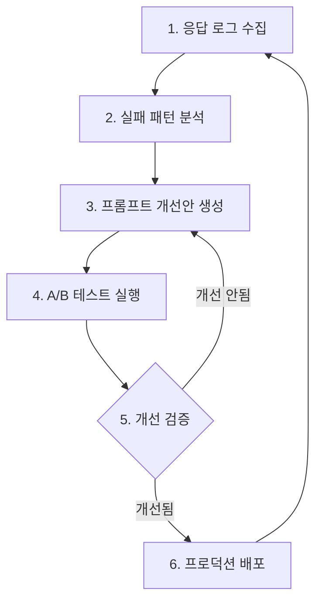

# 프롬프트 자동 최적화 시스템 PRD

> **문서 버전**: 1.0.0
> **작성일**: 2026-01-30
> **상태**: 계획 (Planning)
> **담당팀**: SSAFY YEJI AI팀

---

## 목차

1. [배경 및 문제 정의](#1-배경-및-문제-정의)
2. [목표](#2-목표)
3. [시스템 구성요소](#3-시스템-구성요소)
4. [평가 메트릭](#4-평가-메트릭)
5. [워크플로우](#5-워크플로우)
6. [기술 스택](#6-기술-스택)
7. [제약사항](#7-제약사항)
8. [구현 계획](#8-구현-계획)
9. [참조 문서](#9-참조-문서)

---

## 1. 배경 및 문제 정의

### 1.1 현황

YEJI AI 서버는 yeji-8b-rslora-v7-AWQ 모델과 Qwen3 시리즈를 사용하여 동양 사주(Eastern)와 서양 점성술(Western) 기반의 운세 해석을 제공합니다. 현재 LLM 응답 품질에 다음과 같은 문제가 발생하고 있습니다.

### 1.2 LLM 응답 품질 불안정성

| 문제 유형 | 설명 | 발생 빈도 |
|-----------|------|-----------|
| **스키마 불일치** | 기대한 JSON 구조와 실제 출력 불일치 | 약 30% |
| **필수 필드 누락** | keywords, final_verdict 등 필수 필드 미생성 | 약 25% |
| **코드 불일치** | `"fixed"` vs `"FIXED"`, 한글 vs 영문 코드 | 약 20% |
| **응답 반복** | JSON 이후 대화 시뮬레이션이 무한 반복 | 약 15% |
| **다국어 쓰레기** | 태국어, 아랍어 등 무작위 문자 혼입 | 약 5% |

### 1.3 수동 프롬프트 튜닝의 한계

| 한계점 | 설명 |
|--------|------|
| **반복적 시행착오** | 프롬프트 수정 → 테스트 → 실패 분석의 반복 |
| **도메인 커버리지 부족** | Eastern/Western 각각 별도 프롬프트 관리 부담 |
| **회귀 문제** | 한 문제 해결 시 다른 문제 발생 가능성 |
| **품질 측정 어려움** | 개선 효과의 정량적 측정 부재 |
| **확장성 제한** | 새로운 운세 타입 추가 시 반복 작업 필요 |

### 1.4 영향 범위

| 지표 | 현재 값 | 목표 값 |
|------|---------|---------|
| Pydantic 검증 실패율 | **~30%** | 5% 이하 |
| 503 에러 발생률 | **~3%** | 0.5% 이하 |
| 빈 keywords 응답률 | **~20%** | 5% 이하 |
| 사용자 재시도율 | **~15%** | 3% 이하 |

---

## 2. 목표

### 2.1 핵심 목표

**"자동화된 프롬프트 평가 및 최적화 파이프라인 구축으로 LLM 응답 품질을 지속적으로 개선"**

### 2.2 정량적 목표 (KPI)

| 지표 | 현재 | 목표 | 비고 |
|------|------|------|------|
| **검증 실패율** | 30% | **5% 이하** | 핵심 목표 |
| 스키마 준수율 | 70% | **95% 이상** | Schema Compliance |
| 필드 완성도 | 75% | **95% 이상** | Field Completeness |
| 코드 유효성 | 80% | **98% 이상** | Code Validity |
| 프롬프트 개선 주기 | 수동 | **주 1회 자동** | 자동화 |

### 2.3 정성적 목표

1. **데이터 기반 의사결정**: 직관이 아닌 메트릭 기반 프롬프트 개선
2. **지속적 개선**: 수동 개입 없이 품질 모니터링 및 개선안 도출
3. **재현 가능성**: 평가 결과의 일관성 및 추적 가능성 확보
4. **확장성**: 새로운 운세 타입/모델 추가 시 쉬운 적용

### 2.4 비목표 (Out of Scope)

| 비목표 | 이유 |
|--------|------|
| LLM 모델 재학습 | 별도 프로젝트로 분리 (비용/시간) |
| 프론트엔드 스키마 변경 | API 호환성 유지 필요 |
| 실시간 프롬프트 교체 | 안정성 우선, 배포 주기로 관리 |

---

## 3. 시스템 구성요소

### 3.1 전체 아키텍처

```
┌─────────────────────────────────────────────────────────────────────┐
│                        YEJI AI Server                                │
│  ┌─────────────┐    ┌─────────────┐    ┌─────────────────────────┐  │
│  │   API       │───▶│ LLM Engine  │───▶│ Response Logger (#53)   │  │
│  │   Request   │    │  (Qwen3)    │    │ (JSONL 로그 수집)       │  │
│  └─────────────┘    └─────────────┘    └──────────┬──────────────┘  │
└──────────────────────────────────────────────────│──────────────────┘
                                                   │
                                                   ▼
┌──────────────────────────────────────────────────────────────────────┐
│                   프롬프트 최적화 파이프라인 (신규)                    │
│                                                                       │
│  ┌─────────────────┐    ┌─────────────────┐    ┌─────────────────┐   │
│  │ 1. 로그 수집기  │───▶│ 2. G-Eval      │───▶│ 3. 패턴 분석기  │   │
│  │   (Log Reader)  │    │   평가기        │    │  (Analyzer)     │   │
│  └─────────────────┘    └─────────────────┘    └────────┬────────┘   │
│                                                          │           │
│                                                          ▼           │
│  ┌─────────────────┐    ┌─────────────────┐    ┌─────────────────┐   │
│  │ 6. 배포 관리자  │◀───│ 5. A/B 테스터  │◀───│ 4. 프롬프트     │   │
│  │   (Deployer)    │    │   (Tester)      │    │   최적화기      │   │
│  └─────────────────┘    └─────────────────┘    └─────────────────┘   │
│                                                                       │
│  [선택적] DSPy/GEPA 최적화기                                         │
│  ┌─────────────────────────────────────────────────────────────────┐ │
│  │  DSPy Optimizer: 자동 프롬프트/Few-shot 최적화                   │ │
│  │  GEPA: Gradient-free Evolutionary Prompt Adaptation              │ │
│  └─────────────────────────────────────────────────────────────────┘ │
└──────────────────────────────────────────────────────────────────────┘
```

### 3.2 구성요소 상세

#### 3.2.1 응답 수집/로깅 (완료 - #53)

**현재 구현 상태**: `ai/src/yeji_ai/services/response_logger.py`

```python
# 이미 구현된 ResponseLogger 기능
- JSONL 형식 로그 저장 (일별 로테이션)
- 비동기 큐 기반 성능 최적화
- 성공/검증에러/파싱에러/연결에러/타임아웃 분류
- 요청 입력, 원본 응답, 파싱 결과, 레이턴시 저장
```

**로그 스키마**:
```json
{
  "request_id": "uuid",
  "timestamp": "ISO8601",
  "fortune_type": "eastern|western|full",
  "request_input": { "birth_year": 1990, ... },
  "raw_response": "LLM 원본 응답",
  "parsed_response": { ... },
  "validation": {
    "status": "success|validation_error|json_parse_error|...",
    "error_type": "ValidationError",
    "error_message": "...",
    "validation_errors": [...]
  },
  "latency_ms": 1500,
  "model_name": "Qwen3-8B",
  "temperature": 0.7
}
```

#### 3.2.2 G-Eval 평가기 (LLM-as-a-Judge)

**목적**: LLM을 활용한 응답 품질 자동 평가

**평가 방식**:
```python
class GEvalEvaluator:
    """G-Eval 기반 LLM 응답 평가기"""

    def __init__(self, judge_model: str = "Qwen3-8B"):
        """
        평가 모델 초기화

        Args:
            judge_model: 평가에 사용할 LLM 모델
                - Qwen3-8B: 빠른 평가 (기본)
                - Qwen3-30B-A3B: 정밀 평가
        """
        self.judge_model = judge_model

    async def evaluate(
        self,
        response: dict,
        schema: dict,
        criteria: list[EvalCriteria],
    ) -> EvalResult:
        """
        응답 품질 평가

        Args:
            response: 평가 대상 LLM 응답
            schema: 기대 JSON 스키마
            criteria: 평가 기준 목록

        Returns:
            EvalResult: 점수 및 피드백
        """
        ...
```

**평가 프롬프트 템플릿**:
```
/no_think
당신은 JSON 응답 품질 평가 전문가입니다.

## 평가 대상
{response_json}

## 기대 스키마
{expected_schema}

## 평가 기준
1. Schema Compliance (스키마 준수): 0-10점
2. Field Completeness (필드 완성도): 0-10점
3. Code Validity (코드 유효성): 0-10점

## 평가 결과 (JSON)
{
  "schema_compliance": { "score": 0-10, "issues": ["..."] },
  "field_completeness": { "score": 0-10, "missing_fields": ["..."] },
  "code_validity": { "score": 0-10, "invalid_codes": ["..."] },
  "overall_score": 0-10,
  "improvement_suggestions": ["..."]
}
```

#### 3.2.3 DSPy/GEPA 최적화기 (선택적)

**DSPy 적용 시나리오**:
- 자동 프롬프트 최적화
- Few-shot 예시 자동 선택
- Chain-of-Thought 최적화

```python
# DSPy 활용 예시 (선택적 구현)
import dspy

class FortuneSignature(dspy.Signature):
    """운세 해석 시그니처"""
    birth_data: str = dspy.InputField()
    fortune_type: str = dspy.InputField()
    interpretation: str = dspy.OutputField()

class FortuneInterpreter(dspy.Module):
    def __init__(self):
        self.interpret = dspy.Predict(FortuneSignature)

    def forward(self, birth_data: str, fortune_type: str) -> str:
        return self.interpret(
            birth_data=birth_data,
            fortune_type=fortune_type,
        ).interpretation
```

**GEPA (Gradient-free Evolutionary Prompt Adaptation)**:
- 유전 알고리즘 기반 프롬프트 진화
- LLM 호출 없이 프롬프트 변형 생성
- 평가 결과 기반 선택/교차/변이

---

## 4. 평가 메트릭

### 4.1 Schema Compliance (스키마 준수)

**정의**: LLM 응답이 기대 JSON 스키마를 준수하는 정도

**측정 방법**:
```python
def evaluate_schema_compliance(
    response: dict,
    expected_schema: dict,
) -> SchemaComplianceResult:
    """
    스키마 준수율 평가

    검사 항목:
    1. 필수 필드 존재 여부
    2. 필드 타입 일치 여부
    3. 중첩 구조 일치 여부 (list vs object)
    4. 추가 필드 유무 (strict mode)

    Returns:
        SchemaComplianceResult:
            - score: 0.0 ~ 1.0
            - violations: 위반 목록
    """
    ...
```

**점수 계산**:
```
Schema Compliance = (준수 필드 수 / 전체 필수 필드 수) × 100%
```

**위반 유형**:
| 위반 유형 | 심각도 | 예시 |
|-----------|--------|------|
| 필수 필드 누락 | Critical | `keywords` 배열 없음 |
| 타입 불일치 | High | `list` 대신 `object` |
| 구조 불일치 | High | 중첩 구조 변형 |
| 추가 필드 | Low | 스키마 외 필드 포함 |

### 4.2 Field Completeness (필드 완성도)

**정의**: 필드 값이 의미 있게 채워진 정도

**측정 방법**:
```python
def evaluate_field_completeness(
    response: dict,
    required_fields: list[str],
    min_content_lengths: dict[str, int],
) -> FieldCompletenessResult:
    """
    필드 완성도 평가

    검사 항목:
    1. 빈 문자열 여부 (empty string)
    2. 빈 배열 여부 (empty array)
    3. null/None 값 여부
    4. 최소 콘텐츠 길이 충족 여부
    5. 기본값 사용 여부 (placeholder 감지)

    Returns:
        FieldCompletenessResult:
            - score: 0.0 ~ 1.0
            - empty_fields: 비어있는 필드 목록
            - placeholder_fields: 기본값 사용 필드 목록
    """
    ...
```

**필드별 최소 요구사항**:
| 필드 경로 | 최소 길이 | 필수 항목 수 |
|-----------|-----------|--------------|
| `chart.summary` | 50자 | - |
| `stats.keywords` | - | 2개 이상 |
| `final_verdict.summary` | 100자 | - |
| `detailed_analysis` | - | 2개 이상 |

### 4.3 Code Validity (코드 유효성)

**정의**: 도메인 코드가 정의된 값 집합에 속하는지 여부

**측정 방법**:
```python
def evaluate_code_validity(
    response: dict,
    code_definitions: dict[str, set[str]],
) -> CodeValidityResult:
    """
    코드 유효성 평가

    검사 항목:
    1. 대소문자 일치 여부
    2. 정의된 enum 값 여부
    3. 유사어 사용 여부 (매핑 가능)

    Returns:
        CodeValidityResult:
            - score: 0.0 ~ 1.0
            - invalid_codes: 잘못된 코드 목록
            - mappable_codes: 매핑 가능한 코드 목록
    """
    ...
```

**코드 정의 예시**:
```python
CODE_DEFINITIONS = {
    # Eastern (동양 사주)
    "five_elements": {"WOOD", "FIRE", "EARTH", "METAL", "WATER"},
    "ten_gods": {
        "BI_GYEON", "GEOP_JAE", "SIK_SIN", "SANG_GWAN",
        "PYEON_JAE", "JEONG_JAE", "PYEON_GWAN", "JEONG_GWAN",
        "PYEON_IN", "JEONG_IN",
    },

    # Western (서양 점성술)
    "element_4": {"FIRE", "EARTH", "AIR", "WATER"},
    "modality_3": {"CARDINAL", "FIXED", "MUTABLE"},
    "keywords": {
        "EMPATHY", "INTUITION", "IMAGINATION", "BOUNDARY",
        "LEADERSHIP", "PASSION", "ANALYSIS", "STABILITY",
        "COMMUNICATION", "INNOVATION", "SENSITIVITY", "CREATIVITY",
    },
}
```

### 4.4 종합 평가 점수

```python
@dataclass
class OverallEvaluation:
    """종합 평가 결과"""
    schema_compliance: float  # 0.0 ~ 1.0
    field_completeness: float  # 0.0 ~ 1.0
    code_validity: float  # 0.0 ~ 1.0

    @property
    def overall_score(self) -> float:
        """가중 평균 점수 계산"""
        weights = {
            "schema_compliance": 0.4,  # 가장 중요
            "field_completeness": 0.35,
            "code_validity": 0.25,
        }
        return (
            self.schema_compliance * weights["schema_compliance"]
            + self.field_completeness * weights["field_completeness"]
            + self.code_validity * weights["code_validity"]
        )

    @property
    def pass_threshold(self) -> bool:
        """합격 기준 충족 여부"""
        return (
            self.schema_compliance >= 0.95
            and self.field_completeness >= 0.90
            and self.code_validity >= 0.98
        )
```

---

## 5. 워크플로우

### 5.1 전체 프로세스



### 5.2 단계별 상세

#### 5.2.1 응답 로그 수집

**실행 주기**: 실시간 (기존 ResponseLogger 활용)

**수집 데이터**:
- 요청 입력 (생년월일, 성별 등)
- LLM 원본 응답 (raw_response)
- 파싱된 응답 (parsed_response)
- 검증 결과 (validation status, errors)
- 메타데이터 (latency, model, temperature)

**저장 위치**: `logs/llm_responses/YYYY-MM-DD.jsonl`

#### 5.2.2 실패 패턴 분석

**실행 주기**: 일별 배치 (새벽 3시)

**분석 항목**:
```python
class FailurePatternAnalyzer:
    """실패 패턴 분석기"""

    async def analyze(
        self,
        logs: list[LLMResponseLog],
        date_range: tuple[date, date],
    ) -> FailureReport:
        """
        실패 패턴 분석

        분석 항목:
        1. 에러 유형별 분포 (validation, json_parse, timeout)
        2. 누락 필드 Top 10
        3. 잘못된 코드 Top 10
        4. 구조 불일치 패턴
        5. 시간대별 실패율 추이

        Returns:
            FailureReport: 실패 패턴 리포트
        """
        ...
```

**출력 리포트 예시**:
```json
{
  "date_range": ["2026-01-23", "2026-01-30"],
  "total_requests": 10000,
  "failure_rate": 0.28,
  "error_distribution": {
    "validation_error": 2500,
    "json_parse_error": 200,
    "timeout_error": 100
  },
  "top_missing_fields": [
    {"field": "stats.keywords", "count": 2000},
    {"field": "final_verdict.advice", "count": 1500}
  ],
  "top_invalid_codes": [
    {"code": "fixed", "expected": "FIXED", "count": 800},
    {"code": "창의성", "expected": "INNOVATION", "count": 500}
  ],
  "improvement_priority": [
    "keywords 배열 필수 생성 강조",
    "코드 대소문자 명시"
  ]
}
```

#### 5.2.3 프롬프트 개선안 생성

**실행 주기**: 실패 패턴 분석 후 자동 또는 수동 트리거

**개선 전략**:
| 전략 | 설명 | 적용 조건 |
|------|------|----------|
| **예시 추가** | Few-shot 예시 보강 | 구조 불일치 다발 시 |
| **제약 강화** | 금지 사항 명시 추가 | 코드 불일치 다발 시 |
| **구조 단순화** | 중첩 구조 평면화 | 복잡도 높은 스키마 |
| **지시 반복** | 핵심 지시 반복 강조 | 특정 필드 누락 시 |

**자동 개선안 생성 (LLM 활용)**:
```python
IMPROVEMENT_GENERATION_PROMPT = """
/no_think
당신은 LLM 프롬프트 최적화 전문가입니다.

## 현재 프롬프트
{current_prompt}

## 실패 패턴 분석 결과
{failure_report}

## 요청
위 실패 패턴을 해결하기 위한 프롬프트 개선안을 제시하세요.

## 개선안 형식 (JSON)
{
  "changes": [
    {
      "type": "add_example|add_constraint|simplify|emphasize",
      "location": "프롬프트 내 위치",
      "original": "원본 텍스트 (해당 시)",
      "modified": "수정된 텍스트",
      "rationale": "수정 이유"
    }
  ],
  "expected_improvement": "예상 개선 효과",
  "risk_assessment": "잠재적 부작용"
}
"""
```

#### 5.2.4 A/B 테스트

**실행 주기**: 개선안 생성 후 자동 실행

**테스트 설계**:
```python
@dataclass
class ABTestConfig:
    """A/B 테스트 설정"""
    test_id: str
    control_prompt: str  # 기존 프롬프트 (A)
    variant_prompt: str  # 개선 프롬프트 (B)
    sample_size: int = 100  # 각 그룹당 샘플 수
    test_inputs: list[dict]  # 테스트 입력 데이터
    metrics: list[str] = field(default_factory=lambda: [
        "schema_compliance",
        "field_completeness",
        "code_validity",
    ])
```

**테스트 실행 로직**:
```python
class ABTester:
    """A/B 테스트 실행기"""

    async def run_test(
        self,
        config: ABTestConfig,
    ) -> ABTestResult:
        """
        A/B 테스트 실행

        1. 테스트 입력을 A/B 그룹에 무작위 배정
        2. 각 그룹에 대해 LLM 호출 실행
        3. 응답 품질 평가 (G-Eval)
        4. 통계적 유의성 검정 (t-test)
        5. 결과 리포트 생성

        Returns:
            ABTestResult: 테스트 결과
        """
        ...
```

**통계적 유의성 검정**:
- **검정 방법**: Two-sample t-test (양측 검정)
- **유의 수준**: α = 0.05
- **최소 효과 크기**: Cohen's d ≥ 0.3

#### 5.2.5 배포

**실행 조건**:
1. A/B 테스트 통과 (유의미한 개선)
2. 회귀 테스트 통과 (기존 기능 유지)
3. 승인 (자동 또는 수동)

**배포 방식**:
```python
class PromptDeployer:
    """프롬프트 배포 관리자"""

    async def deploy(
        self,
        new_prompt: str,
        prompt_type: str,  # "eastern" | "western"
        test_result: ABTestResult,
    ) -> DeploymentResult:
        """
        프롬프트 배포

        1. 버전 관리 (git 커밋)
        2. 롤백 지점 저장
        3. 프로덕션 적용
        4. 모니터링 알림 설정

        Returns:
            DeploymentResult: 배포 결과
        """
        ...
```

**롤백 전략**:
- **자동 롤백 조건**: 배포 후 1시간 내 실패율 50% 증가 시
- **수동 롤백**: Slack/Discord 알림 후 수동 트리거

---

## 6. 기술 스택

### 6.1 핵심 기술

| 구성요소 | 기술 | 버전 | 용도 |
|----------|------|------|------|
| **평가 모델** | Qwen3 | 8B/30B-A3B | G-Eval Judge |
| **로그 저장** | JSONL | - | 응답 로그 |
| **데이터 분석** | Pandas | 2.x | 로그 분석 |
| **통계 검정** | SciPy | 1.x | A/B 테스트 |
| **스케줄링** | APScheduler | 3.x | 배치 작업 |

### 6.2 선택적 기술

| 구성요소 | 기술 | 용도 | 적용 조건 |
|----------|------|------|----------|
| **자동 최적화** | DSPy | 프롬프트 최적화 | 복잡한 최적화 필요 시 |
| **진화적 최적화** | GEPA | 프롬프트 진화 | API 비용 절감 시 |
| **대시보드** | Streamlit | 시각화 | 모니터링 필요 시 |

### 6.3 Qwen3 활용 전략

**평가 모델 선택 기준**:
| 모델 | 용도 | 비용/속도 |
|------|------|----------|
| Qwen3-8B | 일상 평가 (대량) | 저비용/빠름 |
| Qwen3-30B-A3B | 정밀 평가 (샘플링) | 중비용/보통 |
| Qwen3-235B-A22B | 최종 검증 | 고비용/느림 |

**프롬프트 설정**:
```python
# 평가 모드 설정 (Non-Thinking 권장)
EVAL_PARAMS = {
    "temperature": 0.3,  # 일관성 우선
    "top_p": 0.8,
    "max_tokens": 2048,
    "presence_penalty": 0.0,
}
```

---

## 7. 제약사항

### 7.1 기술적 제약

| 제약사항 | 설명 | 대응 방안 |
|----------|------|----------|
| **외부 API 호출 최소화** | 비용 절감 필요 | 로컬 Qwen3 활용 |
| **레이턴시 영향 없음** | 프로덕션 응답 지연 금지 | 평가는 비동기/배치 |
| **메모리 제한** | 서버 리소스 제약 | 로그 로테이션 |

### 7.2 비즈니스 제약

| 제약사항 | 설명 |
|----------|------|
| **품질 저하 금지** | 개선 시도 중에도 기존 품질 유지 |
| **변경 추적** | 모든 프롬프트 변경 이력 기록 |
| **롤백 가능** | 언제든 이전 버전 복구 가능 |

### 7.3 운영 제약

| 제약사항 | 설명 |
|----------|------|
| **무중단 운영** | 평가/최적화가 서비스에 영향 없음 |
| **알림 체계** | 중요 이벤트 Slack/Discord 알림 |
| **주간 리포트** | 품질 변화 추이 리포트 자동 생성 |

---

## 8. 구현 계획

### 8.1 파일 구조

```
ai/src/yeji_ai/
├── optimization/                    # 신규 모듈
│   ├── __init__.py
│   ├── evaluators/
│   │   ├── __init__.py
│   │   ├── base.py                  # 평가기 인터페이스
│   │   ├── g_eval.py                # G-Eval 평가기
│   │   ├── schema_compliance.py     # 스키마 준수 평가
│   │   ├── field_completeness.py    # 필드 완성도 평가
│   │   └── code_validity.py         # 코드 유효성 평가
│   ├── analyzers/
│   │   ├── __init__.py
│   │   ├── failure_pattern.py       # 실패 패턴 분석
│   │   └── log_reader.py            # 로그 읽기 유틸리티
│   ├── optimizers/
│   │   ├── __init__.py
│   │   ├── prompt_generator.py      # 개선안 생성
│   │   └── dspy_optimizer.py        # DSPy 최적화 (선택적)
│   ├── testers/
│   │   ├── __init__.py
│   │   └── ab_tester.py             # A/B 테스터
│   ├── deployers/
│   │   ├── __init__.py
│   │   └── prompt_deployer.py       # 배포 관리
│   └── config.py                    # 최적화 설정
├── services/
│   └── response_logger.py           # 기존 (수정 없음)
└── tests/
    └── optimization/
        ├── test_evaluators.py
        ├── test_analyzers.py
        └── test_ab_tester.py
```

### 8.2 단계별 구현 계획

| 단계 | 내용 | 예상 기간 | 우선순위 |
|------|------|----------|----------|
| **Phase 1** | 평가기 구현 | 3일 | P0 |
| 1.1 | SchemaComplianceEvaluator | 1일 | |
| 1.2 | FieldCompletenessEvaluator | 1일 | |
| 1.3 | CodeValidityEvaluator | 1일 | |
| **Phase 2** | 분석기 구현 | 2일 | P0 |
| 2.1 | LogReader (JSONL 파서) | 0.5일 | |
| 2.2 | FailurePatternAnalyzer | 1.5일 | |
| **Phase 3** | G-Eval 평가기 | 2일 | P1 |
| 3.1 | GEvalEvaluator (LLM Judge) | 2일 | |
| **Phase 4** | A/B 테스터 | 2일 | P1 |
| 4.1 | ABTester 구현 | 1.5일 | |
| 4.2 | 통계 검정 로직 | 0.5일 | |
| **Phase 5** | 프롬프트 최적화기 | 2일 | P2 |
| 5.1 | 개선안 자동 생성 | 2일 | |
| **Phase 6** | 배포 관리자 | 1일 | P2 |
| 6.1 | 버전 관리/롤백 | 1일 | |
| **Phase 7** | 통합 및 테스트 | 2일 | P0 |
| **Phase 8** | 문서화 | 1일 | P1 |

**총 예상 기간**: 15일 (3주)

### 8.3 마일스톤

| 마일스톤 | 완료 기준 | 목표 일자 |
|----------|----------|----------|
| **M1: 평가 시스템** | 로그 분석 및 메트릭 계산 가능 | 1주차 |
| **M2: A/B 테스트** | 프롬프트 비교 테스트 가능 | 2주차 |
| **M3: 자동화** | 주간 자동 분석/개선안 생성 | 3주차 |

---

## 9. 참조 문서

| 문서 | 경로 | 설명 |
|------|------|------|
| LLM 응답 후처리 PRD | `ai/docs/prd/llm-response-postprocessor.md` | 후처리 시스템 |
| LLM 출력 품질 분석 | `docs/analysis/LLM_OUTPUT_QUALITY_ANALYSIS.md` | 현재 문제 분석 |
| Qwen3 프롬프팅 가이드 | `ai/docs/guides/qwen3-prompting-guide.md` | 프롬프트 작성 가이드 |
| Response Logger | `ai/src/yeji_ai/services/response_logger.py` | 로깅 구현체 (#53) |
| 프론트엔드 스키마 | `docs/workflow/LLM_STRUCTURED_OUTPUT_PRD.md` | 기대 스키마 정의 |

---

## 변경 이력

| 버전 | 날짜 | 변경 내용 | 작성자 |
|------|------|----------|--------|
| 1.0.0 | 2026-01-30 | 초기 버전 | YEJI AI팀 |

---

## 부록

### A. G-Eval 평가 프롬프트 전문

```
/no_think
당신은 LLM JSON 응답 품질 평가 전문가입니다.

## 작업
주어진 LLM 응답을 기대 스키마와 비교하여 품질을 평가하세요.

## 평가 대상 응답
```json
{response}
```

## 기대 스키마
```json
{schema}
```

## 평가 기준

### 1. Schema Compliance (스키마 준수)
- 모든 필수 필드 존재 여부
- 필드 타입 일치 여부 (list vs object 등)
- 중첩 구조 정확성

### 2. Field Completeness (필드 완성도)
- 빈 문자열/배열 여부
- 최소 콘텐츠 길이 충족 여부
- 의미 있는 값 포함 여부

### 3. Code Validity (코드 유효성)
- 정의된 enum 값 사용 여부
- 대소문자 일치 여부
- 한글/영문 코드 규칙 준수 여부

## 출력 형식 (JSON)
{
  "schema_compliance": {
    "score": 0-10,
    "violations": ["위반 사항 목록"]
  },
  "field_completeness": {
    "score": 0-10,
    "issues": ["문제 사항 목록"]
  },
  "code_validity": {
    "score": 0-10,
    "invalid_codes": [
      {"field": "필드명", "actual": "실제값", "expected": "기대값"}
    ]
  },
  "overall_score": 0-10,
  "improvement_suggestions": ["개선 제안 목록"]
}

평가 결과:
```

### B. DSPy 활용 예시 코드

```python
"""DSPy 기반 프롬프트 최적화 (선택적 구현)"""

import dspy
from dspy.teleprompt import BootstrapFewShot

# LLM 설정
lm = dspy.LM(
    model="vllm/Qwen3-8B",
    api_base="http://localhost:8000/v1",
    temperature=0.7,
)
dspy.configure(lm=lm)


class FortuneInterpretation(dspy.Signature):
    """운세 해석 시그니처"""

    birth_data: str = dspy.InputField(
        desc="생년월일시 정보 (년/월/일/시)"
    )
    fortune_type: str = dspy.InputField(
        desc="운세 타입 (eastern/western)"
    )
    interpretation: str = dspy.OutputField(
        desc="운세 해석 결과 (JSON 형식)"
    )


class FortuneInterpreter(dspy.Module):
    """운세 해석 모듈"""

    def __init__(self):
        super().__init__()
        self.interpret = dspy.ChainOfThought(FortuneInterpretation)

    def forward(self, birth_data: str, fortune_type: str) -> str:
        result = self.interpret(
            birth_data=birth_data,
            fortune_type=fortune_type,
        )
        return result.interpretation


def optimize_fortune_prompt(
    train_examples: list[dspy.Example],
    eval_metric: callable,
) -> FortuneInterpreter:
    """프롬프트 최적화 실행"""

    optimizer = BootstrapFewShot(
        metric=eval_metric,
        max_bootstrapped_demos=4,
        max_labeled_demos=8,
    )

    optimized_module = optimizer.compile(
        FortuneInterpreter(),
        trainset=train_examples,
    )

    return optimized_module
```

---

> **Note**: 이 PRD는 YEJI AI 서버의 프롬프트 최적화 시스템 설계 문서입니다.
> 기존 ResponseLogger(#53)를 활용하여 데이터 기반 프롬프트 개선을 자동화합니다.
